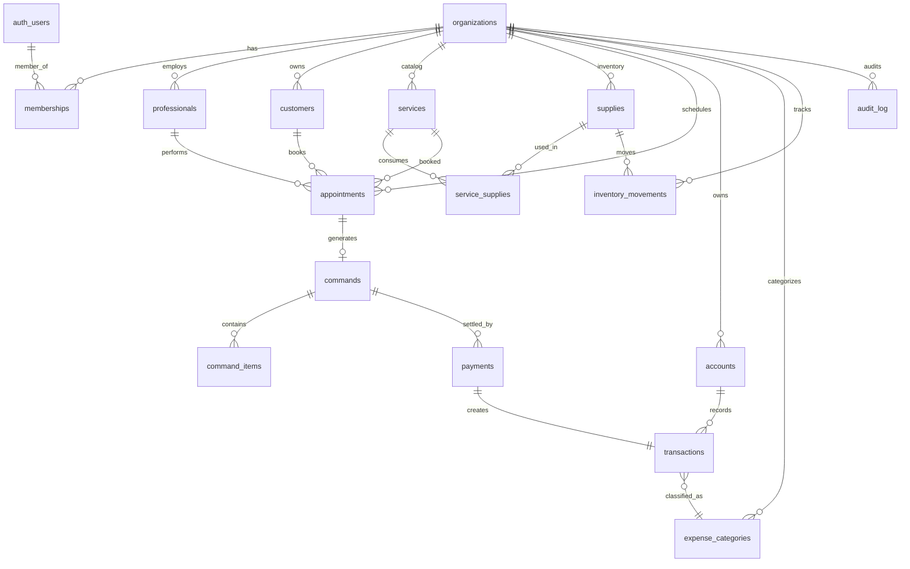

# KEYRA — Fullstack Architecture Document

> **Status:** v1.3 — Foundational design + Stories 0.1, 0.4 implementadas (infra + schema vivo)
> **Author:** @architect (Aria)
> **Date:** 2026-04-16
> **Scope:** Phases 1–4 (MVP) of EPIC-0, with explicit migration paths for Phases 5–7
> **Implementation status:** ver [`docs/IMPLEMENTATION-MAP.md`](../IMPLEMENTATION-MAP.md) para matriz viva.

---

## Companion Documents

> Documentos relacionados que contextualizam, complementam ou consomem este documento de arquitetura.

### Documentos de Produto (fontes / inputs)

| # | Documento | Relação |
|---|-----------|---------|
| 1 | [PRD-KEYRA.md](../prd/PRD-KEYRA.md) | **PRD formal** — cada ADR aqui rastreia para FR/NFR/CON deste documento |
| 2 | [EPIC-0 Master Plan](../stories/EPIC-0-KEYRA-IMPLEMENTATION.md) | Roadmap de 8 fases — esta arquitetura cobre Phases 1–7 |
| 3 | [contexto-completo-keyra.md](../audios-idealizadora/contexto-completo-keyra.md) | Visão da idealizadora — fonte dos princípios UX inegociáveis (P2, P8) |
| 4 | [visao-keyra-idealizadora.md](../audios-idealizadora/visao-keyra-idealizadora.md) | Documento narrativo da visão estratégica |

### Pesquisa Competitiva (referências de stack/UX)

| # | Documento | Uso na arquitetura |
|---|-----------|--------------------|
| 5 | [Conta Azul reverse engineering](../research/2026-04-12-conta-azul-reverse-engineering.md) | Anti-padrão: ERP genérico com lançamento manual — arquitetura aqui inverte isso |
| 6 | [Gestek reverse engineering](../research/2026-04-12-gestek-reverse-engineering.md) | Referência de pricing baixo + agenda-first |
| 7 | [Kamino reverse engineering](../research/2026-04-12-kamino-reverse-engineering.md) | Referência de régua de cobrança e fluxo financeiro automatizado |

### Documentos Operacionais (consumidores / suporte)

| # | Documento | Relação |
|---|-----------|---------|
| 8 | [INFRA-STATUS.md](../INFRA-STATUS.md) | **Snapshot vivo** — estado real de GitHub, Vercel, Supabase, domínio |
| 9 | [SCHEMA.md](SCHEMA.md) | DDL detalhado: 21 tabelas, ER, mapeamento entidade → FR — implementação do ADR-013 |
| 10 | [IMPLEMENTATION-MAP.md](../IMPLEMENTATION-MAP.md) | **Matriz viva** feature × tela × tabela × ADR × story × status |
| 11 | [CREDENTIALS.md](../setup/CREDENTIALS.md) | Estrutura de credenciais isoladas |
| 12 | [README.md](../../README.md) | Visão geral do projeto |

### Squads AIOX (consumidores diretos por fase)

| # | Documento | Fase EPIC-0 |
|---|-----------|-------------|
| 11 | [squad-keyra-bootstrap](../../squads/squad-keyra-bootstrap/squad.yaml) | Phase 0 — entregou arquitetura, schema, wireframes |
| 12 | [squad-keyra-core](../../squads/squad-keyra-core/squad.yaml) | Phases 2–4 — implementam ADR-007 a ADR-016 |
| 13 | [squad-keyra-intelligence](../../squads/squad-keyra-intelligence/squad.yaml) | Phases 5–6 — pricing engine + projeções |
| 14 | [squad-keyra-integrations](../../squads/squad-keyra-integrations/squad.yaml) | Phase 7 — ADR-014 OCR + Asaas + WhatsApp |

---

## 0. Sumário Executivo

KEYRA é o "primeiro financeiro operacional para estética": a agenda dispara o financeiro automaticamente. Esta arquitetura prioriza **time-to-market**, **automação inquebrável do fluxo `Servico → Agenda → Comanda → Transacao → DRE`** e **isolamento multi-tenant inviolável**, em uma stack mínima onde **uma única aplicação Next.js + Supabase entrega todo o MVP** sem refator estrutural até a Fase 7.

**Stack consolidada:** Next.js 16 (App Router) + Supabase (Postgres + Auth + Storage + Edge Functions) + Vercel + shadcn/ui + Tailwind v4 + TanStack Query + Zod.

**Decisões inegociáveis:**
1. Single-app Next.js (não monorepo no MVP)
2. Server Actions como API primária (no REST/GraphQL boilerplate)
3. RLS como camada de autorização principal (`org_id` em toda tabela tenant-scoped)
4. Inngest para jobs assíncronos (OCR, projeções, recálculo de DRE)
5. Stripe para billing SaaS (assinaturas) + Asaas para Pix de operação (Fase 7)

---

## 1. Princípios Arquiteturais (Inegociáveis)

| # | Princípio | Implicação |
|---|-----------|-----------|
| P1 | **KISS no MVP** | Zero infraestrutura que não sirva às Fases 1–4. Toda complexidade é justificada por uma story do EPIC-0. |
| P2 | **Automação > UX manual** | O sistema NUNCA pede ao usuário para lançar algo que ele já informou na agenda. Stories que violem isso são rejeitadas. |
| P3 | **Multi-tenancy first** | Toda tabela tenant-scoped tem `org_id NOT NULL` + RLS. Sem exceção. Testado em todas as queries. |
| P4 | **Determinismo financeiro** | Valores monetários em `numeric(14,2)` no Postgres + `Decimal.js` no app. Nunca `float`. Arredondamento `ROUND_HALF_EVEN` (banker's rounding). |
| P5 | **Server-first rendering** | RSC + Server Actions por padrão. Client components só onde houver interatividade real (agenda, formulários, dashboards). |
| P6 | **Type-safe end-to-end** | Tipos do Postgres → Supabase CLI → TS. Validação Zod em toda Server Action. |
| P7 | **No Invention (Article IV)** | Cada decisão abaixo justifica-se em FR/NFR do EPIC-0 ou pesquisa Conta Azul. Nada de "achei legal". |
| P8 | **LGPD by design** | Audit log desde o dia 1. Criptografia de campo para CPF e dados bancários. Soft delete + retention policy. |

---

## 2. Stack Decision (ADR-001 a ADR-005)

### ADR-001 — Confirmar Next.js 15 (na verdade 16) + Supabase + Vercel

**Status:** ACCEPTED
**Contexto:** EPIC-0 sugere Next.js 15 + Supabase + Vercel. Tech preset ativo é `nextjs-react`.
**Decisão:** Adotar **Next.js 16 (App Router)** como framework único, **Supabase** como BaaS (Postgres 16 + Auth + Storage + Edge Functions + Realtime), **Vercel** como hosting/edge.

**Justificativa:**
- Stack mais rápido para MVP financeiro com auth + RLS + tipagem ponta-a-ponta sem custo operacional.
- RLS do Supabase resolve isolamento multi-tenant determinístico (P3) sem reinventar middleware.
- Vercel + Next.js elimina infra (CDN, edge, preview deploys, env management).
- Custo previsível para o ticket-alvo (R$ 79–199/mês vs Conta Azul R$ 159–720) — Supabase Pro $25/mês + Vercel Pro $20/mês cobre as primeiras ~200 organizações.

**Trade-offs:**
- (-) Lock-in dual: Vercel (build/runtime) e Supabase (DB+Auth). Mitigação: Postgres é portável; Auth é replaceable (NextAuth se preciso); Vercel pode migrar para Cloudflare/AWS via OpenNext.
- (-) Edge Functions Supabase usam Deno (runtime diferente do Next/Node) — usar só onde justificado (OCR worker isolado).
- (+) Supabase fornece Postgres "puro" (no PlanetScale-style restrictions): triggers, functions, RLS, extensões (pg_cron, pgvector futuro).

**Alternativas descartadas:**
- T3 Stack (tRPC + Prisma) — overhead de tRPC duplica boilerplate vs Server Actions; Prisma cliente pesado; RLS via Prisma é tooling-pesado.
- AWS (Amplify/Cognito/RDS) — over-engineering para MVP solo-dev; setup 10x mais lento.
- Convex — muito acoplado; sem Postgres = sem audit trail SQL nativo nem futura migração contábil.

**[DECISÃO RESOLVIDA — D1 fechada 2026-04-16]:** Vercel **Hobby (Free)** durante MVP. Upgrade para **Pro ($20/mês)** obrigatório antes do 1º paying customer (commercial-use license requer Pro). Story `h8.2` da Sprint 8 cobre a migração + rotação de credenciais expostas em chat. Detalhes em INFRA-STATUS.md §2.

---

### ADR-002 — UI: shadcn/ui + Tailwind v4 + Radix Primitives

**Status:** ACCEPTED
**Decisão:** **shadcn/ui** (componentes copiados, não dependência) sobre **Radix UI Primitives** + **Tailwind CSS v4** + **Lucide Icons**. Nenhuma UI library "fechada" (MUI, Mantine, Chakra).

**Justificativa:**
- Princípio UX da idealizadora: "números absolutos, tela única, simplicidade" → exige controle granular do design system. UIs fechadas têm opinião visual incompatível.
- shadcn = código no nosso repo → debugging, customização, zero version-pinning hell.
- Radix garante acessibilidade (WCAG AA) sem reinventar (keyboard nav, focus-trap, ARIA).
- Tailwind v4 (2026): CSS-first config, native cascade layers, JIT por padrão — melhor DX e performance.
- Lucide: ícones lineares consistentes, tree-shakeable.

**Trade-offs:**
- (-) Time-to-first-screen ~20% maior que MUI plug-and-play.
- (+) Customização total para o "dashboard de números absolutos" (dificilmente um Card MUI atende).
- (+) Bundle menor (~40KB inicial vs ~200KB MUI).

**Stack complementar:**
- **Forms:** `react-hook-form` + `zodResolver`
- **Tables:** `@tanstack/react-table` (headless, integra com shadcn DataTable)
- **Charts:** `Recharts` (uma chart permitida pela idealizadora — receita vs despesa)
- **Date:** `date-fns` (não Moment, não Day.js — tree-shakeable, locale-pt-br nativo)
- **Calendar/Agenda:** `@fullcalendar/react` (visualização diária/semanal/mensal pronta) — **VALIDAR custo de licença comercial** (FullCalendar Standard é MIT, Premium é pago para timeline view).

**[DECISÃO RESOLVIDA — D2 fechada 2026-05-02]:** **FullCalendar Standard (MIT)** confirmado em prod desde Story 2.4 (entregue 2026-04-30). Decisão materializada de fato — sem reabrir. A view `resource-timegrid` (Premium pago) foi substituída por filtro via `Select` (tech debt registrado em Dev Decisions §1 da Story 2.4) — solução vive no MIT plan sem dependência paga. Migração para `Schedule-X` ou `react-big-calendar` só se houver bloqueador real específico que aparecer pós-MVP.

**Decisão aprovada por:** `@aiox-master` (Orion) — registro retroativo, decisão já em produção há 2 semanas.

---

### ADR-003 — Linguagem & Runtime: TypeScript estrito + Node.js 22 LTS

**Status:** ACCEPTED
**Decisão:** TypeScript com `strict: true`, `noUncheckedIndexedAccess: true`, `exactOptionalPropertyTypes: true`. Node.js 22 LTS (Vercel runtime). pnpm como package manager.

**Justificativa:** Determinismo financeiro (P4) exige tipagem rigorosa. pnpm = workspaces nativos (futuro monorepo) + disk efficiency.

---

### ADR-004 — Validation: Zod + zod-to-json-schema

**Status:** ACCEPTED
**Decisão:** Zod como validador único (input, env vars, formulários, contratos de Server Action).

**Justificativa:** Schema-as-code, type inference automática, runtime + compile-time, integrável com react-hook-form. `zod-to-json-schema` permite gerar OpenAPI/JSON Schema futuramente sem reescrita.

---

### ADR-005 — Decimal: Decimal.js para todo cálculo monetário

**Status:** ACCEPTED
**Decisão:** Toda operação monetária usa `Decimal.js` no client/server. Postgres armazena `numeric(14,2)`. Conversão na borda (Server Action input/output).

**Justificativa:** P4 (determinismo). `0.1 + 0.2 !== 0.3` em float é inaceitável para DRE/comissões/precificação.

---

## 3. Topologia de Aplicações (ADR-006)

### ADR-006 — Single Next.js App (não monorepo no MVP)

**Status:** ACCEPTED
**Contexto:** Tamanho atual: 1 dev (Luiz), MVP em ~13 semanas, ~1 produto, ~1 equipe.

**Decisão:** **Single Next.js application** em `apps/web/` (estrutura preparada para evoluir, mas SEM Turborepo/pnpm-workspaces no dia 1).

**Estrutura inicial:**
```
keyra/
├── apps/
│   └── web/                    # Next.js app único
│       ├── src/
│       │   ├── app/            # App Router (rotas)
│       │   ├── features/       # Feature modules (Contract Pattern)
│       │   ├── components/     # shadcn/ui + componentes compartilhados
│       │   ├── lib/            # supabase clients, utils
│       │   └── server/         # Server Actions, jobs
│       ├── tests/
│       └── package.json
├── supabase/
│   ├── migrations/             # SQL versionadas
│   ├── functions/              # Edge Functions (OCR worker)
│   ├── seed.sql
│   └── config.toml
├── docs/                       # PRD, architecture, stories
├── package.json                # Root (scripts orquestradores)
├── pnpm-workspace.yaml         # Pré-criado, vazio (preparação)
└── turbo.json                  # Pré-criado, mínimo (preparação)
```

**Justificativa:**
- Monorepo só faz sentido com ≥2 apps deployáveis ou ≥2 packages compartilhados. KEYRA não tem isso.
- Premature monorepo = setup overhead de 1–2 semanas que não entrega valor de produto.
- `apps/web` + `pnpm-workspace.yaml` vazio garante migração trivial quando justificada (Story futura: "extrair @keyra/finance-domain para package").

**Quando promover para monorepo (gatilhos):**
- Adicionar app mobile React Native → criar `apps/mobile/` + extrair `packages/shared-types/`.
- Adicionar worker dedicado (Phase 7 Asaas reconciliation) → `apps/worker/`.
- Logica financeira reutilizada por API pública → `packages/finance-engine/`.

**Trade-off aceito:** Imports absolutos via `@/` (tsconfig paths) — Constitution Article VI compliance.

---

## 4. Camadas da Aplicação (ADR-007 a ADR-009)

### ADR-007 — API: Server Actions como primária, Route Handlers para webhooks/integrações

**Status:** ACCEPTED

**Decisão:**
| Tipo de chamada | Mecanismo | Justificativa |
|----------------|-----------|---------------|
| Mutações UI (criar agendamento, registrar pagamento, criar comanda) | **Server Actions** (`'use server'`) | Type-safe, sem boilerplate de client SDK, integra nativamente com forms/RSC, suporta progressive enhancement |
| Queries de dados para componentes server | **Server Components + Supabase server client** | Zero round-trip, RLS aplicada via JWT |
| Queries dinâmicas no client (dashboard ao vivo, filtros) | **TanStack Query + Server Actions** ou **Supabase client (RLS)** | Cache inteligente, optimistic updates |
| Webhooks externos (Stripe, Asaas, WhatsApp) | **Route Handlers** em `app/api/webhooks/*/route.ts` | Endpoints públicos com assinatura HMAC |
| Realtime (futuro: notificação de agendamento alterado) | **Supabase Realtime** sobre `appointments` | Postgres WAL → broadcast WebSocket nativo |

**Por que NÃO tRPC:**
- Server Actions já fornecem type-safety end-to-end no App Router (RSC envia o tipo).
- tRPC adiciona ~3K linhas de boilerplate (router, procedures, context, middleware) sem benefício marginal no Next 16.
- Migração futura para tRPC continua trivial (cada Server Action vira procedure).

**Por que NÃO REST/OpenAPI no MVP:**
- Único consumidor é o próprio frontend Next. REST sem cliente externo é cerimônia.
- Quando surgir necessidade (mobile app, integração 3rd-party), expor endpoints específicos via Route Handlers + Zod + `zod-to-json-schema`.

**Trade-offs:**
- (-) Server Actions executam no servidor Next (não Edge por padrão para Postgres). Aceito: latência adicional de ~50–100ms vs Edge é irrelevante para CRUD financeiro.
- (-) Server Actions não cacheable em CDN. Aceito: nada do KEYRA é cacheable público.

---

### ADR-008 — Data Access: dual Supabase client (server vs browser)

**Status:** ACCEPTED

**Decisão:** Wrapper único em `src/lib/supabase/` com 3 clients:

```typescript
// src/lib/supabase/server.ts        — RSC, Server Actions, Route Handlers
export function createServerClient() // usa cookies(), aplica JWT do user

// src/lib/supabase/browser.ts       — Client Components (raro)
export function createBrowserClient() // anon key + JWT do cookie

// src/lib/supabase/admin.ts         — APENAS jobs/webhooks
export function createAdminClient() // service_role key, BYPASS RLS — uso restrito
```

**Regras (codificadas como ESLint rule):**
- `admin.ts` só pode ser importado de `src/server/jobs/*` ou `src/app/api/webhooks/*`.
- Nunca expor service_role no client bundle (build-time check).
- Toda Server Action começa com `const supabase = await createServerClient()` — RLS sempre ativo.

**Tipos:** Gerados via `supabase gen types typescript` em `src/lib/supabase/database.types.ts`. CI valida frescor (compara checksum com migrations).

---

### ADR-009 — Background Jobs: Inngest

**Status:** ACCEPTED para Fases 5–7 (atualizado 2026-05-02 após D3 fechada). **Não usado nas Fases 1–4.**

**Contexto:** Fases 1–4 não tiveram jobs assíncronos reais (tudo é mutação síncrona ou view on-demand). A partir da Fase 5 (precificação inteligente + projeções iniciais) e Fase 7 (OCR de PDFs, integrações), surgem jobs com necessidade real de fan-out + retry + observability.

**Decisão:** **Inngest** como orquestrador de jobs (queue + scheduler + retry + observability).

**Por que Inngest vs alternativas:**

| Opção | Pros | Cons | Veredito |
|-------|------|------|----------|
| **Inngest** | Type-safe (TS-first), free tier generoso (5K steps/mo), event-driven nativo, dashboard incluído, deploy trivial no Vercel | Vendor lock parcial (mas events portáveis) | **ESCOLHIDA** |
| QStash (Upstash) | Simples HTTP scheduler, barato | Sem orquestração de step functions, sem dashboard rico | Bom para cron simples; Inngest cobre + step functions |
| Vercel Cron | Grátis, integrado | Só cron (não event-driven, sem retry inteligente, sem fan-out) | Insuficiente para OCR pipeline |
| Supabase pg_cron | Roda dentro do DB | Sem retry, sem observability, lock-in pg | Bom para data hygiene (cleanup audit logs); **complementar ao Inngest** |
| Trigger.dev | Concorrente direto | Pricing menos previsível, comunidade menor | Dispensado |

**Casos de uso planejados:**
- Phase 4: `recompute-monthly-dre` (cron diário 03:00, recalcula agregados materializados)
- Phase 4: `dashboard-metrics-warm` (refresh views materializadas)
- Phase 6: `weekly-profit-projection` (projeção via agenda futura)
- Phase 7: `parse-bank-statement` (OCR de PDF) — fan-out: upload → extract → categorize → review-queue
- Phase 7: `send-payment-reminder` (régua WhatsApp para inadimplentes)

**Trade-offs:**
- (-) Mais um vendor. Mitigação: jobs como Inngest functions são funções TS puras — migração para BullMQ/Trigger.dev é mecânica.
- (+) Free tier suporta MVP até ~500 orgs ativas.

**[DECISÃO RESOLVIDA — D3 fechada 2026-05-02]:** Inngest entra a partir da **Phase 5** (não Phase 4). Justificativa: Phase 4 entregou DRE on-demand via 6 views Postgres (`v_dre_monthly`, `v_dre_by_service`, `v_dre_by_professional`, `v_cashflow_daily`, `v_dashboard_kpis`, `v_receitas_previstas`) com `security_invoker=true`, e o feedback de Sprint 4 confirmou que performance é aceitável sem materialização agressiva. Postergar Inngest evita custo cognitivo + dependência sem necessidade — ele entra junto com a primeira projeção preditiva (Story `i6.1` weekly-profit-projection) e o pipeline OCR (Story `g7.1`). Casos `recompute-monthly-dre` e `dashboard-metrics-warm` migram para Phase 5 ou descartados se views continuarem dentro do budget.

**Decisão aprovada por:** `@aiox-master` (Orion) — registro autônomo, justificado por dado empírico de Sprint 4 (typecheck/lint/build verdes + smoke RLS + 5 deploys READY sem job assíncrono).

---

## 5. Autenticação & Multi-Tenancy (ADR-010 a ADR-012)

### ADR-010 — Supabase Auth (email/senha + magic link)

**Status:** SUPERSEDED por **ADR-022** em 2026-05-04 — ver §11.2.

**Decisão original (histórica):** Supabase Auth, Email + senha (primário) + Magic Link (recuperação).

**Por que foi superseded:** Story auth.4 (Fase B do EPIC-AUTH-V2) implementou login email+senha como único método sem fallback magic link, e Story auth.5 vai usar `resetPasswordForEmail` (fluxo de reset, NÃO magic link de login) para recovery. Magic link foi **removido inteiro da plataforma** por decisão estratégica da idealizadora em 2026-05-04. Detalhes da nova decisão e suas migrations/stories em ADR-022 §11.2.

**MVP (Fase 1) — texto histórico, não vigente:**
- Sign up: email + senha + nome
- Login: email + senha
- Reset: magic link
- **NÃO no MVP:** Social login (Google/Apple), MFA, SSO

**Pós-MVP (Phase 5+) — texto histórico:** MFA via TOTP (compliance LGPD para clínicas com dados sensíveis), Google OAuth (esteticistas usam muito) — Google OAuth virou Story auth.6 do EPIC-AUTH-V2.

---

### ADR-011 — Modelo Multi-Tenant: Single DB + RLS + `org_id` em toda tabela tenant-scoped

**Status:** ACCEPTED — **CRÍTICO**

**Padrão escolhido:** **Shared database, shared schema, RLS por `org_id`**.

**Por que NÃO schema-per-tenant ou DB-per-tenant:**
- Schema-per-tenant: explosão de migrations (cada tenant precisa migrar), Supabase não otimiza isso.
- DB-per-tenant: custo proibitivo no MVP (Supabase Pro $25/mês × N), provisioning complexo.
- RLS shared: padrão Supabase battle-tested (Cal.com, Resend, Linear early days), single migration para todos.

**Esquema-base:**

```sql
-- Toda tabela tenant-scoped:
CREATE TABLE <entity> (
  id uuid PRIMARY KEY DEFAULT gen_random_uuid(),
  org_id uuid NOT NULL REFERENCES organizations(id) ON DELETE CASCADE,
  -- ... outros campos
  created_at timestamptz NOT NULL DEFAULT now(),
  updated_at timestamptz NOT NULL DEFAULT now(),
  deleted_at timestamptz NULL  -- soft delete
);
CREATE INDEX <entity>_org_id_idx ON <entity>(org_id);
ALTER TABLE <entity> ENABLE ROW LEVEL SECURITY;

-- RLS policy padrão (CRUD por membership):
CREATE POLICY "<entity>_tenant_isolation" ON <entity>
  USING (org_id = (SELECT current_org_id()));
```

**Helper SQL (em todas as policies):**
```sql
-- Função SECURITY DEFINER que lê org_id do JWT custom claim
CREATE OR REPLACE FUNCTION current_org_id() RETURNS uuid
LANGUAGE sql STABLE SECURITY DEFINER AS $$
  SELECT (auth.jwt() ->> 'org_id')::uuid;
$$;
```

---

### ADR-012 — JWT custom claim `org_id` + troca de organização

**Status:** ACCEPTED

**Mecanismo:**
1. User loga via Supabase Auth → token JWT padrão sem `org_id`.
2. **Hook server (Postgres trigger ou Edge Function):** após login, lê `members` table (FK user_id → org_id), define `org_id` no JWT via Supabase Auth Hook (`custom_access_token_hook`).
3. Se user ∈ múltiplas orgs: cookie `keyra-active-org` indica org ativa; ao trocar, refresh do token via Server Action `switchOrganization(orgId)`.

**Esquema:**
```sql
CREATE TABLE memberships (
  id uuid PRIMARY KEY DEFAULT gen_random_uuid(),
  user_id uuid NOT NULL REFERENCES auth.users(id) ON DELETE CASCADE,
  org_id uuid NOT NULL REFERENCES organizations(id) ON DELETE CASCADE,
  role text NOT NULL CHECK (role IN ('owner','admin','professional','viewer')),
  created_at timestamptz NOT NULL DEFAULT now(),
  UNIQUE(user_id, org_id)
);
```

**Fluxo de switch:**
- Server Action verifica que user é member da org-alvo.
- Chama `supabase.auth.refreshSession()` com novo claim.
- Set cookie `keyra-active-org`.
- `redirect('/dashboard')`.

**Validação:** Toda RLS policy depende do `current_org_id()`. Se o claim faltar, a policy falha-fechado (acesso negado).

**Teste obrigatório (Phase 1):** Test suite com 2 orgs A e B, usuário X ∈ A, usuário Y ∈ B → verificar que X não lê NADA de B em nenhuma query, mesmo com IDs adivinhados.

**Trade-offs:**
- (-) JWT precisa refresh ao trocar org (latência ~200ms).
- (+) Toda a autorização vive no Postgres — uma query SQL não-conforme falha automaticamente.

---

## 6. Modelo de Dados (Alto Nível) — ADR-013

### ADR-013 — Entidades Core (delegado a @data-engineer Story 0.4 para DDL)

**Status:** ACCEPTED — **alto nível**. DDL detalhado: @data-engineer Story 0.4.

**Entidades MVP (Fases 1–4):**



**Tabelas (resumo):**

| Tabela | Propósito | Fase |
|--------|-----------|------|
| `organizations` | Tenant root (clínica/studio) | 1 |
| `memberships` | User × Organization × Role | 1 |
| `professionals` | Profissionais que executam serviços (FK opcional para auth.users) | 1 |
| `customers` | CRM (paciente) | 2 |
| `services` | Catálogo (serviço/produto/protocolo/pacote, com price + cost + duration) | 2 |
| `supplies` | Insumos do estoque | 2 |
| `service_supplies` | M:N (insumo consumido por serviço, com quantidade) | 2 |
| `appointments` | Agendamento (status: scheduled/done/cancelled/no_show) | 2 |
| `commands` | Comanda (gerada automaticamente quando appointment=done) | 3 |
| `command_items` | Itens da comanda (serviço executado, valor, comissão) | 3 |
| `payments` | Pagamento (Pix/cartão/dinheiro; valor bruto, taxa, líquido) | 3 |
| `accounts` | Contas financeiras (caixa, banco, maquininhas) | 3 |
| `transactions` | Lançamento (origem: command \| manual \| import) | 3 |
| `expense_categories` | Plano de contas (pré-configurado estética + customizável) | 3 |
| `inventory_movements` | Entrada/saída de insumos (rateio automático no atendimento) | 3 |
| `goals` | Metas mensais (suporte mentora) | 4 |
| `audit_log` | Audit trail (LGPD) | 1 (desde o dia 1) |

**Tabelas Phase 5+:**

| Tabela | Propósito | Fase |
|--------|-----------|------|
| `pricing_models` | Motor de precificação | 5 |
| `package_definitions` | Pacotes (5 sessões com 10% off) | 5 |
| `documents` | PDFs uploadados (extratos, maquininhas) | 7 |
| `document_extractions` | OCR results (com revisão humana) | 7 |
| `subscriptions` (Stripe mirror) | Assinatura SaaS | 1 (paywall) ou 5 (trial-first) |
| `whatsapp_messages` | Log de mensagens enviadas | 7 |

**Decisões de modelagem chave:**

1. **`appointments → commands` é 1:0..1**: nem todo agendamento gera comanda (cancelado/falta não geram). A comanda é criada **automaticamente via trigger** quando `appointments.status` muda para `done`.

2. **`commands → payments` é 1:N**: uma comanda pode ser paga em parcelas/métodos múltiplos (ex: R$ 100 cartão + R$ 50 Pix).

3. **`payments → transactions` é 1:1**: cada pagamento gera uma transação financeira. Trigger Postgres garante consistência.

4. **`transactions.origin enum`**: `command_payment | manual_expense | manual_income | bank_import | adjustment` — permite rastrear automação vs lançamento manual.

5. **`receita prevista` é uma view materializada** (`v_receitas_previstas`) baseada em `appointments` com status `scheduled` e `services.price`. NÃO é tabela. Recalculada por Inngest cron.

6. **`DRE` é computada on-demand** (Fase 4) via SQL function `compute_dre(org_id, start_date, end_date)`. Pré-computada via materialized view se performance exigir (Phase 5).

7. **Comissão por profissional** modelada em `command_items.commission_rate` (snapshot no momento da execução, NÃO referência a `professionals.default_commission_rate` — preserva histórico).

**Triggers Postgres críticos:**
- `trg_appointment_done_creates_command`: appointments.status → done ⇒ INSERT em commands + command_items (snapshot do serviço).
- `trg_payment_creates_transaction`: INSERT em payments ⇒ INSERT em transactions.
- `trg_command_done_creates_inventory_movement`: command finalizada ⇒ baixa supplies via service_supplies.
- `trg_audit_log`: AFTER UPDATE/DELETE em todas tabelas tenant-scoped ⇒ INSERT em audit_log.
- `trg_set_updated_at`: BEFORE UPDATE em todas as tabelas.

**Justificativa de triggers vs Server Actions:**
- Triggers garantem invariantes mesmo se um futuro endpoint pular a Server Action (defense-in-depth).
- Performance: 1 transação Postgres ao invés de 3 round-trips.
- Atomicidade: se transaction falhar, comanda não é criada órfã.

---

## 7. Pipeline OCR / Documentos (ADR-014) — Phase 7

### ADR-014 — Edge Functions Supabase + Inngest fan-out + Google Document AI

**Status:** ACCEPTED (Phase 7) — promovido de PROPOSED em 2026-05-02 após D4 fechada.

**Decisão:**

```
Upload PDF (Server Action)
    │
    └─→ Supabase Storage (bucket: documents/{org_id}/{doc_id}.pdf)
            │
            └─→ INSERT documents (status: pending)
                    │
                    └─→ Inngest event: document/uploaded
                            │
                            ├─→ Step 1: extract-text (Edge Function Deno + pdfjs-dist)
                            │       └─ Output: raw_text
                            │
                            ├─→ Step 2: parse-structured (Document AI ou GPT-4o-mini)
                            │       └─ Output: structured_data (transactions array)
                            │
                            ├─→ Step 3: categorize (regras + LLM fallback)
                            │       └─ Output: classified transactions
                            │
                            └─→ Step 4: enqueue-review (cria review-queue UI)
                                    └─ Human valida → INSERT em transactions
```

**Componentes:**
- **Edge Function `extract-text`**: Deno + pdfjs-dist, isolada do app principal (timeouts longos OK), runs no Supabase.
- **Document AI (Google) ou GPT-4o-mini**: parse estruturado. Avaliar custo: Document AI ~$0.30/página; GPT-4o-mini ~$0.005/PDF de extrato. **Decidir após PoC com 10 extratos reais (Itaú, Nubank, Cielo)**.
- **Inngest** orquestra fan-out + retry + observability.
- **Review queue**: UI no app onde human valida antes do INSERT em `transactions` (regra: nunca aceitar OCR direto sem confirmação humana — confiança financeira).

**Banks/Acquirers prioritários (Phase 7):**
- Bancos: Itaú, Bradesco, Nubank, Inter (cobrem ~80% do público estética).
- Maquininhas: Cielo, Stone, PagSeguro, Mercado Pago.

**[DECISÃO RESOLVIDA — D4 fechada 2026-05-02]:** **PoC paralelo Document AI vs GPT-4o-mini** na primeira story `g7.1` (Upload e Parsing PDFs). Métricas obrigatórias da PoC: (1) precisão por banco (Itaú, Nubank, Cielo — top 3 do público estética), com 3 extratos reais cada; (2) custo por PDF processado; (3) latência média p95; (4) score de confiança calibrado contra ground truth manual. Decisão final do provider em até 14 dias após start da PoC. Vencedor entra como dependência única; perdedor fica como fallback documentado se houver outage.

**Decisão aprovada por:** `@aiox-master` (Orion) — alinhado com recomendação Aria. Squad responsável: `squad-keyra-integrations` via `@document-processor` (Íris).

---

## 8. Observabilidade (ADR-015)

### ADR-015 — Stack mínima: Sentry + Vercel Analytics + PostHog (futuro)

**Status:** ACCEPTED

**Decisão:**

| Camada | Ferramenta | Quando |
|--------|-----------|--------|
| **Error tracking** (frontend + backend + Edge Functions) | **Sentry** | MVP (Phase 1) |
| **Performance Web Vitals + page views** | **Vercel Analytics** (built-in) | MVP (Phase 1) |
| **Logs estruturados** | `console.log` JSON → Vercel Log Drains → **Axiom** (free tier) | Phase 2 |
| **Product analytics** (funnel, retention, feature usage) | **PostHog Cloud** (free tier 1M events/mo) | Phase 4 |
| **Database observability** | **Supabase built-in** (query stats, logs explorer) | MVP |
| **Uptime** | **BetterStack** (free tier) ou Vercel checks | Phase 2 |
| **Tracing distribuído** | NÃO no MVP (over-engineering) | Phase 6+ |

**Por que NÃO Datadog/New Relic:** Custo desproporcional para MVP solo-dev. Sentry + Vercel + PostHog cobrem 95% das necessidades a custo zero/baixo.

**Logging convention:**
```typescript
import { logger } from '@/lib/logger'  // pino + pretty (dev) | json (prod)
logger.info({ orgId, userId, action: 'create_appointment', appointmentId }, 'appointment created')
```

**Eventos críticos a logar:**
- Toda Server Action (start/success/error com duration_ms)
- Toda RLS policy violation (tentativa cross-tenant)
- Toda mutação financeira (payments, transactions) com before/after
- Webhooks recebidos (Stripe, Asaas) com signature verified

---

## 9. Pagamentos & Billing (ADR-016)

### ADR-016 — Stripe para SaaS billing + Asaas para Pix de operação (separados)

**Status:** ACCEPTED — **separação clara de concerns**

**Há duas dimensões financeiras DIFERENTES no KEYRA:**

#### A) Billing SaaS (KEYRA cobra das clínicas)

**Decisão:** **Stripe** + Stripe Billing (subscriptions) + Stripe Tax (BR).

**Por que Stripe vs Asaas para SaaS:**
- Subscription management maduro (trial 14d, upgrade/downgrade, prorate, dunning automático).
- Customer Portal grátis (clínica gerencia cartão sozinha).
- Webhook robusto + idempotency.
- Suporte a Pix recorrente (lançado 2025) + cartão.
- Stripe Tax calcula imposto SaaS por estado BR.

**Esquema de mirror:**
```
Stripe Subscription → Webhook → INSERT/UPDATE em subscriptions (mirror local)
                              → UPDATE organizations.plan = 'start' | 'crescimento' | 'autoridade'
                              → UPDATE organizations.subscription_status = 'active' | 'past_due' | 'canceled'
```

**Source of truth:** **Stripe** (não o DB local). DB local é cache para autorização.

#### B) Pagamentos operacionais (clínica recebe da paciente)

**Decisão:** **MVP: registro manual** (paciente paga via Pix/cartão por fora, esteticista marca como "pago" na comanda).

**Phase 7:** **Asaas** para Pix automático e cobrança recorrente de pacotes.

**Por que Asaas vs Stripe para operação:**
- Asaas é especializado BR (Pix nativo, NF-e/NFS-e integradas, cobrança boleto).
- Tarifa de Pix 0% (Asaas) vs 0.99% + R$ 0.39 (Stripe BR).
- Subconta Asaas por organização (split de pagamento futuro).

**Trade-off:** Dois providers, dois SDKs. Aceito porque servem propósitos ortogonais.

**[DECISÃO RESOLVIDA — D5 fechada 2026-05-02]:** **Stripe** confirmado como provider principal para SaaS billing. Iugu/Vindi ficam como **fallback documentado** caso fricção de cartão internacional vire problema real (≥10% das tentativas de checkout falhando por cartão BR não aceito, medido após 30 dias do go-live comercial). Justificativa: (1) Subscription mgmt + Customer Portal + dunning automático = ganho operacional alto; (2) Stripe Tax calcula imposto SaaS por estado BR; (3) Pix recorrente lançado em 2025 já cobre o caso de uso brasileiro nativo; (4) Webhook idempotency robusto + signature HMAC ergonômico.

**Trigger de revisão:** se métricas de checkout `payment_failed_card_declined` >= 10% após 30 dias com >= 50 paying customers, abrir story de migração para Iugu como provider primário (esquema mirror já é genérico — só troca SDK).

**Decisão aprovada por:** `@aiox-master` (Orion) — alinhado com recomendação Aria.

---

## 10. Segurança & LGPD (ADR-017 a ADR-019)

### ADR-017 — Encryption at rest: Supabase nativo (AES-256)

**Status:** ACCEPTED

**Decisão:** Confiar em **Supabase Postgres native encryption** (AES-256 at rest, TLS 1.3 in transit) para o grosso dos dados.

**Para campos sensíveis** (CPF, dados bancários, prontuário) → **encryption at column** via `pgcrypto`:

```sql
-- Exemplo: customers.cpf criptografado
ALTER TABLE customers ADD COLUMN cpf_encrypted bytea;
-- Server Action criptografa antes de INSERT:
INSERT INTO customers (..., cpf_encrypted)
VALUES (..., pgp_sym_encrypt($1, current_setting('app.encryption_key')));
```

**Chave:** Variável de ambiente Vercel (`COLUMN_ENCRYPTION_KEY`), rotacionada via Story dedicada (Phase 5).

**Trade-off:** queries por CPF ficam impossíveis sem desencriptar. Aceito (busca por CPF é raro; usar hash em coluna separada se necessário).

---

### ADR-018 — Audit log desde o dia 1

**Status:** ACCEPTED — **CRÍTICO LGPD**

**Estrutura:**
```sql
CREATE TABLE audit_log (
  id bigserial PRIMARY KEY,
  org_id uuid NOT NULL,
  user_id uuid NULL,           -- null para system actions
  action text NOT NULL,        -- 'create' | 'update' | 'delete' | 'login' | 'export'
  resource_type text NOT NULL, -- 'appointment' | 'transaction' | 'customer' | ...
  resource_id uuid NULL,
  before jsonb NULL,           -- estado antes (UPDATE/DELETE)
  after jsonb NULL,            -- estado depois (CREATE/UPDATE)
  ip_address inet NULL,
  user_agent text NULL,
  created_at timestamptz NOT NULL DEFAULT now()
);
CREATE INDEX audit_log_org_id_created_at_idx ON audit_log(org_id, created_at DESC);
CREATE INDEX audit_log_resource_idx ON audit_log(resource_type, resource_id);
```

**Implementação:**
- Triggers Postgres para mutações em tabelas tenant-scoped (automático).
- Server Action explícita para exports/logins.
- Retention: 5 anos (Lei Civil) → particionamento por mês via pg_partman (Phase 5).

---

### ADR-019 — LGPD compliance toolkit (Sprint 8 / Pré-Phase 5)

**Status:** ACCEPTED — promovido de PROPOSED em 2026-05-02. Reposicionado para **Sprint 8 (hardening)** como pré-condição obrigatória do go-live comercial.

**Reposicionamento:** originalmente alocado em Phase 4. Como Phases 1-4 fecharam sem implementar este toolkit (gap real flagrado no relatório PO Master 2026-05-02), o trabalho foi **escalado para Sprint 8** junto com testes TS, Vercel Pro e PostHog. Nada do MVP é colocado em produção pública sem este toolkit ativo.

**Funcionalidades obrigatórias (entregáveis da Sprint 8):**

| Funcionalidade | Story | Tabela | Server Action |
|----------------|-------|--------|---------------|
| Registro de consentimento | `h8.4` | `consent_records (org_id, user_id, version, accepted_at, ip, user_agent)` | `recordConsent(version)` no signup/onboarding |
| Direito de acesso (export) | `h8.5` | — (lê todas as 21 tabelas filtrando por user_id/org_id) | `exportUserData(userId)` retorna ZIP com JSON + CSV |
| Direito ao esquecimento | `h8.6` | (extensão de tabelas existentes com `anonymized_at`) | `anonymizeCustomer(customerId)` substitui PII por hash determinístico, preserva agregados |
| DPO contact | `h8.7` | — (página estática `/legal/dpo`) | — |
| Termos + Política versionados | `h8.8` | `terms_versions (id, content_md, published_at)` + `consent_records.version` | `getCurrentTermsVersion()` + force re-aceite no boundary `requireAuth` |
| Audit log de exports/exclusões | (já existe) | `audit_log` com `action='export'` ou `'anonymize'` | log via trigger + Server Action explícita |

**Gate compliance obrigatório:** toda story `h8.4`-`h8.8` passa por `@compliance-br *lgpd-audit` antes do `@qa` (Phase 3.5 já formalizado).

**Decisão aprovada por:** `@aiox-master` (Orion).

---

## 11. Critérios Não-Funcionais (ADR-020)

### ADR-020 — Performance, Disponibilidade, RPO/RTO

**Status:** ACCEPTED

| Métrica | Alvo MVP | Alvo Phase 6+ | Como medir |
|---------|----------|---------------|------------|
| **FCP Dashboard** | < 1.5s (P75, 4G) | < 1.0s | Vercel Analytics |
| **TTI Dashboard** | < 3.0s (P75) | < 2.0s | Vercel Analytics |
| **Server Action P95** | < 800ms | < 400ms | Sentry + custom logs |
| **Database query P95** | < 200ms | < 100ms | Supabase logs |
| **Uptime mensal** | ≥ 99.5% (~3.6h downtime/mês) | ≥ 99.9% | BetterStack |
| **RPO** (Recovery Point Objective) | ≤ 24h (Supabase daily backup) | ≤ 1h (PITR) | Supabase Pro inclui PITR |
| **RTO** (Recovery Time Objective) | ≤ 4h (restore manual) | ≤ 1h (automated) | Runbook documentado |
| **Bundle inicial JS** | < 200KB (gzipped) | < 150KB | Next bundle analyzer |
| **Concurrent users por org** | 10 (média 3) | 50 | Load test Phase 5 |

**Dashboard performance budget (Phase 4):**
- Tela única, ≤ 8 widgets, ≤ 12 queries SQL totais.
- Materializar agregados mensais (recomputed nightly via Inngest).
- Cache TanStack Query 60s para métricas não-críticas.

**Disaster recovery runbook:** Story Phase 5 dedicada.

---

## 11.1 Email Transacional (ADR-021)

### ADR-021 — Resend + React Email como provedor transacional

**Status:** ACCEPTED (2026-04-20)

**Contexto.** A Story 1.3 (convite de membros por email) é o primeiro disparo de email fora do fluxo de autenticação do Supabase. Precisamos de um provedor com boa deliverability, API simples, templates tipados em TypeScript e custo compatível com um MVP. Mais à frente (Phase 5+) virão: notificações de agenda (lembrete de consulta, cobrança amigável), relatórios mensais de DRE por email e comunicação operacional (reset de senha customizado, aviso de baixa de estoque). Logo, a decisão atual precisa escalar para dezenas de templates e ~5–10 mil emails/mês no ano 1.

**Decisão.** Adotar **[Resend](https://resend.com)** como provedor de email transacional, com templates em **[React Email](https://react.email)** (pacotes `@react-email/components` + `@react-email/render`). Emails disparados a partir do servidor (Server Actions, Route Handlers ou Inngest jobs), nunca do browser.

**Alternativas avaliadas.**

| Opção | Por que não agora |
|-------|-------------------|
| **Supabase Auth email embutido** | Tem limite de ~30 emails/hora no Free e templates são ajustados no painel (não versionados em código). Serve apenas para flows internos de auth (magic link, reset de senha) — não cobre convites de membro, nem notificações futuras. Manteremos esse para os flows de auth hoje; Resend cobre o resto. |
| **Postmark** | Deliverability superior (melhor reputação B2B) a partir de ~$15/mês por 10k emails. Overkill para MVP; reavaliar quando chegarmos em ≥ 50k/mês ou tivermos reclamações de bounce no Resend. |
| **Amazon SES** | Preço imbatível ($0,10 por mil), mas DX ruim, necessita configurar SNS/bounces/complaints manualmente e exige validação de domínio com saída de sandbox. Não compensa o tempo de setup para o volume de MVP. |
| **SendGrid** | Mercado maduro, porém API verbosa, plano Free de 100/dia muito apertado e UX de templates inferior ao combo Resend + React Email. |

**Consequências.**

1. **Custo MVP.** Free até 3 000 emails/mês e 100/dia — cobre toda Phase 1–4 com folga. Upgrade para o plano pago ($20/mês por 50 000) só será necessário em Phase 5+.
2. **Domínio próprio.** Precisamos verificar `keyra.app` em Resend (registros SPF + DKIM + DMARC no Cloudflare) antes de emails reais. Enquanto o DNS não aponta para Vercel, usaremos o subdomínio sandbox `onboarding@resend.dev` com emails limitados a endereços verificados — suficiente para dev e Story 1.3 em ambiente interno.
3. **Bibliotecas adicionadas.** `resend` (SDK), `@react-email/components` (componentes), `@react-email/render` (renderização SSR). Todas server-only. Devem viver atrás de `import 'server-only'` para nunca vazarem para o bundle do cliente.
4. **Env vars novas.** `RESEND_API_KEY` (secret) e `EMAIL_FROM` (plain, default `KEYRA <no-reply@keyra.app>`). Ambas provisionadas em `apps/web/.env.local.example`, `apps/web/src/lib/env.ts` (validação Zod) e nos três targets do Vercel.
5. **Observabilidade.** Resend tem dashboard próprio de delivered/opened/bounced/complained. Em Phase 5 integrar webhooks de bounce/complaint com Inngest para marcar emails ruins em `customers.email_status`.
6. **Idempotência.** Cada Server Action que dispara email deve usar um `idempotency_key` (UUID derivado do convite/lembrete) para evitar duplo envio em caso de retry. Resend aceita o header `Idempotency-Key` nativamente.
7. **Testabilidade.** Em `process.env.NODE_ENV === 'test'` ou quando `RESEND_API_KEY` estiver ausente, o helper `sendEmail` loga o payload em vez de chamar a API — facilita pgTAP/Vitest sem rede.

**Helper canônico (`apps/web/src/lib/email/send.ts`).** Interface única `sendEmail({ to, subject, react, tags })`. React Email compila para HTML via `render()`; fallback para texto plano usando a mesma árvore. Cada template vive em `apps/web/src/emails/<nome>.tsx`.

**Padrões de uso.**

- Server Actions disparam email **após** commit de transação (never before) para que retry seguro não gere duplicata.
- Templates recebem apenas dados derivados do servidor (nunca form values crus) — reforça a borda de validação Zod.
- Nenhum template contém link direto — sempre usa `magic` tokens com TTL (convites 72h, reset 1h).
- Rate limit aplicativo: 10 emails/minuto por `org_id` (enforced no Server Action). Resend já limita a 2 req/s na API.

**Traceability.** ADR-021 é referenciado por Story 1.3 (convites), Story 4.9 (alertas), Story 6.x (lembretes de agenda), Story 7.3 (cobrança WhatsApp cai para email como fallback).

---

## 11.2 Auth UX V2 — cadastro estruturado + email/senha primário (ADR-022)

### ADR-022 — Auth UX V2

**Status:** ACCEPTED — 2026-05-03

**Decisão:** O fluxo de auth do KEYRA muda de **passwordless puro** (magic link único método, ADR-010 original) para **multi-método com email+senha como primário**:

| Método | Status | Uso |
|--------|--------|-----|
| Email + senha | **PRIMÁRIO** | Login padrão para usuários cadastrados |
| Google OAuth | Secundário | Login social conveniente |
| Magic link (OTP) | **Apenas em recovery** | Fluxo "Esqueci minha senha" |

**Cadastro estruturado:** novo formulário em `/cadastro` coleta nome, celular, email, senha+confirmação, nome da clínica, CNPJ e aceite de Termos+Privacidade em uma única tela. Sem ele, dados do usuário-pessoa (nome, telefone) e do tenant (nome clínica, CNPJ) eram coletados de forma fragmentada — ou nunca.

**Foundation de segurança:** o epic é precedido pela story `auth.0` que aplica configuração endurecida do Supabase Auth (confirmação de email obrigatória, senha mínima 10 chars com complexidade, OTP recovery em 30 minutos, signOut global em troca de senha, scrubbing de PII em Sentry, CAPTCHA Turnstile em signup/recovery/login após falhas).

**Schema novo:**
- `public.profiles (id FK auth.users, full_name, phone_encrypted bytea via pgp_sym_encrypt, phone_last_four)` com trigger `on_auth_user_created` garantindo invariante "todo auth.user tem profile"
- `public.legal_documents (type, version, content_hash, content_md, published_at, deprecated_at)` — versionamento imutável de Termos e Privacidade
- `public.user_consent_records (user_id, document_id, accepted_at, ip_address, user_agent)` — registro auditável imutável de aceite
- `UNIQUE INDEX organizations_cnpj_unique` parcial — bloqueia duplicação de clínica

**RPC unificada:** `signup_create_account_atomic(email, senha, nome, celular_encrypted, nome_clinica, cnpj, terms_version, privacy_version)` faz tudo em uma transação Postgres + compensating delete via service_role para `auth.users` órfão se falhar.

**JWT custom claims:** `org_id` (existente) + `full_name` (novo). NÃO `phone` — PII em headers/logs/Sentry breadcrumb é vetor de vazamento.

**Decisões de PII:**
- Telefone: encrypted at column (`pgp_sym_encrypt`) + `phone_last_four` para exibição mascarada — alinhado com NFR-SE-04 do PRD e padrão `customers.cpf_*`
- Email: armazenado em `auth.users.email` (já criptografado em repouso por Supabase nativo)
- CPF: ainda só em `customers` (paciente da clínica, não user da plataforma)

**Trade-offs:**

| Vantagem | Custo |
|----------|-------|
| UX comercial real (login padrão familiar) | +44 pts de implementação distribuídos em 10 stories |
| Cadastro estruturado coleta tudo em 1 tela | Story `auth.3` é a maior (L, 8 pts) |
| Foundation de segurança herdada por todas as stories | Story `auth.0` precede tudo, bloqueia paralelismo da Fase A |
| LGPD compliant desde dia 1 (consent versionado, re-aceite, retenção 30d) | Sobreposição parcial com `h8.4` original (LGPD toolkit) — `h8.4` agora é só anonymize+export+DPO |
| Google OAuth aumenta conversão de signup | Requer OAuth client no Google Cloud Console + provider Supabase config |
| `phone_encrypted` cumpre NFR-SE-04 | Custo de 1 query extra ao decriptar quando precisar exibir |

**Riscos cobertos pela auditoria preventiva** (ver `docs/audit/auth-v2-security-audit.md`):
- 7 críticos: confirmação email, senha fraca, sem CAPTCHA, órfãos auth.users, PII plain, PII em JWT, CNPJ duplicado
- 9 altos: enumeration, ausência de consent_records, termos sem re-aceite, secure_password_change off, OTP 1h, before_user_created ausente, email bombing, tel sem validação, senha em logs Sentry
- 4 médios: brute force distribuído, OAuth incompleto, RLS chicken-and-egg de profiles, rate limit baixo
- 2 baixos: invite UNIQUE não considera revogação, sessão sem timebox

**Riscos residuais aceitos:** brute force distribuído (mitigado por Turnstile + Vercel WAF; Cloudflare Pro WAF fora de escopo agora), phishing externo (user education), compromisso de dispositivo (out of scope).

**Pendências jurídicas postergadas** (autorização da idealizadora 2026-05-03):
- Personalidade jurídica que assina os Termos: **placeholder `[KEYRA — pessoa jurídica a constituir]`** até KEYRA virar empresa formal
- Foro de jurisdição: **default São Paulo/SP**
- Retenção pós-cancelamento: **30 dias** (decidido)

**Traceability.** ADR-022 referenciado por:
- `docs/audit/auth-v2-security-audit.md` (auditoria preventiva — fonte das decisões)
- `docs/stories/EPIC-AUTH-V2.md` (epic com 10 stories)
- Stories `auth.0` a `auth.9`
- Substitui ADR-010 (passwordless único) com transição via Story `auth.5` que mantém magic link só em recovery

---

## 11.3 Comprovantes Inteligentes — captura de documentos com leitura por IA (ADR-023)

### ADR-023 — Comprovantes Inteligentes

**Status:** ACCEPTED — 2026-05-18 (rev. 2 — incorpora pareceres de `@architect` e `@document-processor`; ver `docs/architecture/reviews/`)

**Contexto.** A tese da KEYRA é "o financeiro nasce da operação" (comanda → pagamento → transação). Mas há lançamentos que entram **por fora da comanda** — receitas avulsas (Pix recebido, venda de produto), despesas (taxa de cartão, conta de luz, NF de fornecedor, boleto). Hoje a única forma de registrá-los é digitar manualmente em `/financeiro/receitas` ou `/financeiro/despesas`. É o atrito mais visível pós-MVP: a usuária gasta minutos por dia digitando dados que já estão na foto/PDF do comprovante.

**Decisão.** Criar a feature **Comprovantes Inteligentes**: a usuária anexa um documento em qualquer formato; uma LLM lê e extrai os dados financeiros; a usuária revisa; o sistema cria uma `transactions`. Seis decisões arquiteturais travadas:

| # | Decisão | Razão |
|---|---------|-------|
| 1 | **Direção-agnóstico** — o pipeline trata receita (`credit`) e despesa (`debit`) com a mesma infra; a direção é um campo extraído/revisado | Mesma jornada, mesmo custo de build; cobre os dois atritos |
| 2 | **Provider lock: `openai/gpt-4o-mini` via Vercel AI Gateway** com `disallowPromptTraining: true` | Modelo *vision* barato e suficiente para extração estruturada; AI Gateway dá observabilidade, fallback e troca de modelo sem rebuild |
| 3 | **Revisão humana SEMPRE obrigatória no MVP** | OCR/LLM é falível; nenhuma `transactions` é criada sem confirmação humana — sem auto-aprovação, sem reconciliação automática |
| 4 | **Processamento assíncrono via `next/after`** (Next 16) | Upload não bloqueia a UI; Inngest segue deferido (ADR-009) até o volume passar ~100 comprovantes simultâneos |
| 5 | **Supabase Storage bucket privado** com RLS por `org_id`; acesso só via signed URL de curta duração | Documento financeiro contém PII; isolamento multitenant é invariante #1/#2 do projeto |
| 6 | **Nova tabela `receipts`** como estágio entre o arquivo e o ledger | `transactions` permanece o source-of-truth puro; `receipts` guarda arquivo, extração, revisão e o `transaction_id` resultante |

**Sem ZDR.** OpenAI **não** consta na lista oficial de provedores ZDR (Zero Data Retention) do Vercel AI Gateway — apenas em "disallow prompt training". Vercel Pro segue deferido (sem gatilho comercial atual — ver memória do projeto). **Mitigação obrigatória:** Política de Privacidade v1.1.0 com transparência total sobre o uso de IA + **re-aceite forçado** antes da feature ir a produção. Caminho de upgrade documentado: migrar para `anthropic/claude-haiku` (ZDR) quando Vercel Pro for assinado — story `comprovantes.6+` futura.

**Multi-formato — normalização em camadas.** O banco e o Storage aceitam **qualquer binário**, mas a LLM não lê todos os formatos nativamente. Camada de normalização com 3 tiers:

| Tier | Formatos | Tratamento |
|------|----------|------------|
| **Visão direta** | JPG, PNG, WEBP, HEIC, foto, print | Auto-rotação EXIF (`sharp`) → enviado como *image part* ao modelo vision |
| **Rasterização** | PDF | `gpt-4o-mini` **não** aceita PDF nativo — toda página é rasterizada para imagem antes de ir ao modelo (biblioteca a definir em spike — TD-CMP-008) |
| **Texto puro** | TXT, MD, HTML | Texto extraído e enviado como prompt |
| **Conversão necessária** | DOCX, ODT, RTF, EPUB | Extração de texto via parser JS puro (`mammoth` p/ DOCX; unzip+XML p/ ODT/EPUB); RTF/ODT raros caem para *best effort* → se falhar, revisão manual sem extração |

**Schema.** Tabela `receipts (id, org_id, uploaded_by, file_path, original_filename, mime_type, file_size_bytes, file_hash, normalized_kind, status, extraction_data jsonb, extraction_raw_text, extraction_confidence, extraction_model, extraction_error, reviewed_data jsonb, reviewed_by, reviewed_at, transaction_id, created_at, updated_at, deleted_at)`. `UNIQUE (org_id, file_hash)` garante idempotência — reenviar o mesmo arquivo não duplica. RLS por `org_id` + **trigger de auditoria dedicado** `audit_receipts` (`receipts` não entra no `audit_log` universal, que capturaria jsonb sensível e violaria minimização da LGPD Art. 6º III). `transactions` é reutilizada para o registro final — mas exige **micro-migration aditiva** em `comprovantes.1`: o CHECK de `transactions.source_type` não aceita `'document'` hoje (só `command/payment/invoice/manual/import`), e precisa do novo valor.

**Trade-offs.**

| Vantagem | Custo |
|----------|-------|
| Elimina o atrito #1 pós-MVP (digitação manual) | +47 pts em 6 stories |
| Pipeline único cobre receita e despesa | Normalização multi-formato tem casos *best effort* (ODT/RTF) |
| AI Gateway permite trocar de modelo sem rebuild | Dependência de provider externo → exige nova base legal LGPD |
| Revisão humana sempre → zero risco de transação fantasma | Não há ganho de "lançamento 100% automático" no MVP |
| `next/after` evita custo de infra de fila | Reprocessamento de falhas é manual até Inngest entrar |

**Riscos.** Vazamento de PII via logs (mitigado: scrubbing Sentry estendido para `extraction_data`, `extraction_raw_text`, `reviewed_data`, `file_path`, `signed_url`); documento malicioso (mitigado: validação de MIME por magic bytes, limite de tamanho, arquivo nunca executado — AV scan catalogado como débito técnico); extração incorreta (mitigado: revisão humana obrigatória + score de confiança).

**Traceability.** ADR-023 é referenciado por:
- `docs/architecture/EPIC-COMPROVANTES-SPEC.md` (spec arquitetural completa)
- `docs/stories/EPIC-COMPROVANTES.md` (epic com 6 stories `comprovantes.0`–`comprovantes.5`)
- `docs/architecture/COMPLIANCE-AUDIT-EPIC-COMPROVANTES.md` (auditoria preventiva LGPD)
- `docs/legal/privacy-v1.1.0-DRAFT.md` (nova Política — base legal do tratamento por IA)
- Estende ADR-009 (Inngest deferido) e ADR-017 (criptografia de PII)

---

## 12. Architectural Patterns Aplicados

| Pattern | Onde | Razão |
|---------|------|-------|
| **Server Components (RSC) first** | Toda rota | Latência, bundle, type-safety |
| **Contract Pattern** (do nextjs-react preset) | Cada feature em `src/features/<feature>/<feature>.contract.ts` | Isolamento, refactor seguro |
| **Repository Pattern** (lite) | `src/features/<feature>/<feature>.repository.ts` (Supabase queries puras) | Testabilidade, swap futuro |
| **Service Layer** | `src/features/<feature>/<feature>.service.ts` (regras de negócio) | Reuso entre Server Actions e jobs |
| **Database Triggers** para invariantes financeiras | Postgres | Defense-in-depth |
| **Materialized Views** para agregados pesados | DRE, fluxo de caixa | Performance Phase 4 |
| **Event-driven** (Inngest) | Jobs assíncronos | Desacoplamento, retry |
| **Optimistic UI** (TanStack Query) | Agenda drag-and-drop, status changes | UX responsiva |
| **Audit Log Pattern** | Triggers em todas tabelas | LGPD |
| **Snapshot Pattern** | `command_items` clona dados de `services` | Histórico imutável |

---

## 13. Estrutura de Pastas (`apps/web/src`)

```
apps/web/src/
├── app/                              # Next.js App Router
│   ├── (marketing)/                  # Landing, pricing, blog
│   ├── (auth)/
│   │   ├── login/
│   │   ├── signup/
│   │   └── reset-password/
│   ├── (app)/                        # Protegido (middleware checa session)
│   │   ├── layout.tsx                # Sidebar + topbar (org switcher)
│   │   ├── dashboard/
│   │   ├── agenda/
│   │   ├── customers/
│   │   ├── services/
│   │   ├── inventory/
│   │   ├── financial/
│   │   │   ├── transactions/
│   │   │   ├── dre/
│   │   │   └── cashflow/
│   │   ├── reports/
│   │   └── settings/
│   ├── api/
│   │   └── webhooks/
│   │       ├── stripe/route.ts
│   │       └── asaas/route.ts        # Phase 7
│   └── layout.tsx
│
├── features/                         # Feature modules (Contract Pattern)
│   ├── auth/
│   │   ├── auth.contract.ts
│   │   ├── auth.service.ts
│   │   ├── auth.repository.ts
│   │   └── auth.actions.ts           # Server Actions
│   ├── organization/
│   ├── customer/
│   ├── service/
│   ├── appointment/
│   │   ├── appointment.contract.ts
│   │   ├── appointment.service.ts
│   │   ├── appointment.actions.ts
│   │   └── components/
│   │       ├── AppointmentCalendar.tsx
│   │       └── AppointmentForm.tsx
│   ├── command/
│   ├── payment/
│   ├── transaction/
│   ├── dre/
│   └── inventory/
│
├── components/
│   ├── ui/                           # shadcn primitives
│   ├── layout/
│   └── shared/
│
├── lib/
│   ├── supabase/
│   │   ├── server.ts
│   │   ├── browser.ts
│   │   ├── admin.ts
│   │   └── database.types.ts         # Generated
│   ├── decimal.ts                    # Decimal.js wrapper
│   ├── logger.ts                     # pino
│   ├── env.ts                        # Zod-validated env
│   └── utils.ts
│
├── server/
│   ├── jobs/                         # Inngest functions
│   │   ├── inngest-client.ts
│   │   ├── recompute-dre.ts
│   │   └── projection.ts
│   └── middleware.ts
│
└── styles/
    └── globals.css                   # Tailwind v4
```

---

## 14. CI/CD & Environments

> **Estado atual (2026-04-16):** ambiente Production já provisionado. Staging e Preview-DB virão na Phase 5. Detalhes operacionais vivos em [`docs/INFRA-STATUS.md`](../INFRA-STATUS.md).

| Environment | URL | Branch | DB | Status |
|-------------|-----|--------|----|--------|
| Local | http://localhost:3000 | working branch | Supabase local (Docker) ou projeto remoto via env | Pendente Story 1.1 |
| Preview | auto Vercel preview (`keyra-*.vercel.app`) | every PR | **Phase 1-4: usa o mesmo projeto remoto Supabase**; Branches dedicados na Phase 5 | ✅ provisionado, deploy disparará no 1º push de código Next.js |
| Production | `keyra.app` | `main` | Supabase project `keyra-br` (`oapdfhivzojyahvphebs`, sa-east-1) | ✅ provisionado |
| Staging | `staging.keyra.app` | `main` (futuro) | Supabase Project `keyra-staging` (criar Phase 5) | ⏸️ não provisionado |

**Pipeline (GitHub Actions):**
1. `lint` (ESLint + Prettier check)
2. `typecheck` (`tsc --noEmit`)
3. `test:unit` (Vitest)
4. `test:integration` (Vitest + Supabase local + RLS test suite)
5. `test:e2e` (Playwright contra preview deploy)
6. `migration:check` (Supabase migration linter)
7. Deploy: Vercel auto

**Migrations:**
- Versionadas em `supabase/migrations/<timestamp>_<name>.sql`.
- Aplicadas via `supabase db push` em CI (staging) e manual + aprovação (prod).
- **Nunca** edição direta no Supabase Studio em prod.

---

## 15. Tech Stack Definitiva (snapshot)

| Categoria | Tecnologia | Versão | Razão |
|-----------|-----------|--------|-------|
| Frontend Framework | Next.js | 16.x | App Router, RSC, Server Actions |
| Frontend Language | TypeScript | 5.6+ | strict mode |
| UI Primitives | Radix UI + shadcn/ui | latest | Acessibilidade, customização |
| CSS | Tailwind CSS | 4.x | DX, performance |
| State Management (client) | TanStack Query | 5.x | Cache server-state; **Zustand só se needed** (avoid Redux) |
| Forms | react-hook-form + Zod | latest | Type-safe forms |
| Tables | TanStack Table | 8.x | Headless, integra shadcn DataTable |
| Charts | Recharts | latest | Uma chart permitida (receita vs despesa) |
| Calendar | FullCalendar (Standard) | 6.x | Visualização agenda dia/semana/mês |
| Date | date-fns | 3.x | Locale pt-BR, tree-shakeable |
| Decimal | Decimal.js | latest | Precisão financeira |
| Backend | Next.js Server Actions + Route Handlers | — | API primária |
| Database | Postgres (Supabase) | 16 | RLS, triggers, materialized views |
| Auth | Supabase Auth | latest | Email + Magic Link |
| Storage | Supabase Storage | latest | Uploads PDF (Phase 7) |
| Edge Functions | Supabase Edge (Deno) | latest | OCR worker (Phase 7) |
| Background Jobs | Inngest | latest | Phase 4+ |
| Validation | Zod | 3.x | Schema único |
| Logging | pino | 9.x | JSON estruturado |
| Error Tracking | Sentry | 8.x | Frontend + backend + edge |
| Analytics | Vercel Analytics + PostHog | latest | Web vitals + funnel |
| Testing (unit) | Vitest | 2.x | Fast, ESM-native |
| Testing (E2E) | Playwright | 1.x | Multi-browser |
| Billing | Stripe + Stripe Billing | latest | SaaS subscriptions |
| Payments (operação) | Asaas | latest | Phase 7 — Pix BR |
| Hosting | Vercel | — | Edge, preview deploys |
| CI/CD | GitHub Actions | — | Free para open source / cheap |
| Package Manager | pnpm | 9.x | Workspace-ready |
| Node runtime | Node 22 LTS | — | Vercel default |

---

## 16. Mapeamento Arquitetura ↔ Fases EPIC-0

| Fase EPIC-0 | Stories | Componentes arquiteturais |
|-------------|---------|---------------------------|
| **Phase 1** (1.1–1.5) | Setup, orgs, profissionais, RLS, layout | ADR-001 a ADR-012 + base estrutura |
| **Phase 2** (2.1–2.7) | CRUD pacientes, serviços, agenda | ADR-013 entidades core, FullCalendar |
| **Phase 3** (3.1–3.8) | Comanda, pagamentos, transações, estoque | Triggers Postgres, materialização DRE |
| **Phase 4** (4.1–4.9) | DRE, dashboard, comparativos, alertas | DRE on-demand via 6 views Postgres + `security_invoker=true` (sem Inngest — D3) |
| **Sprint 8 — Hardening** (h8.1–h8.8) | Testes TS, Vercel Pro, rotação credentials, cron healthcheck, PostHog, ADR-019 LGPD toolkit | Vitest ≥70%, Vercel Pro, BetterStack uptime, PostHog 5 eventos canônicos |
| **Phase 5 = EPIC-INTELLIGENCE** (i5.1–i5.7) | Motor precificação, pacotes, simulação, alertas estoque, Stripe billing | ADR-009 Inngest entra aqui, ADR-016 Stripe, pricing engine module |
| **Phase 6 = EPIC-INTELLIGENCE** (i6.1–i6.7) | Projeções, what-if, rentabilidade horário/profissional, prontuário, upsell | Inngest projeções, materialized views complexas, possivelmente OpenAI para upsell (v2) |
| **Phase 7 = EPIC-INTEGRATIONS** (g7.1–g7.5) | OCR PDFs (Document AI vs GPT-4o-mini PoC), Asaas Pix, WhatsApp Business | ADR-014 OCR pipeline, monorepo promotion if needed. **NFS-e movida para Phase 8** (D11) |
| **Phase 8** (m8.1–m8.x) | NFS-e + Marketplace fornecedores | Postergado — complexidade fiscal por município |

**Garantia arquitetural:** Phases 1–4 NÃO requerem refator estrutural. Phases 5–7 requerem **adições** (novos módulos, jobs, providers) mas zero mudança em entidades core.

---

## 17. Decisões — Status Consolidado (2026-05-02)

> Última atualização: 2026-05-02 — round de unblock para abrir Phases 5/7. Decisões D2-D5 + D11 promovidas a `RESOLVIDA`. Pendências reais ficam apenas em D6-D10 (decisões de produto/estratégia, não bloqueiam código).

### Decisões resolvidas

| # | Decisão | Veredito | Resolvida em | Aprovador |
|---|---------|----------|--------------|-----------|
| ~~**D1**~~ | ~~Vercel Pro desde dia 1?~~ | **Hobby Free** até 1º pagante (commercial-use obriga upgrade depois). Story `h8.2` (Sprint 8) migra para Pro antes de go-live | 2026-04-16 | Luiz |
| **D2** | FullCalendar Standard vs Schedule-X? | **FullCalendar Standard (MIT)** — adotado em prod desde Story 2.4. Tech debt `resource-timegrid` resolvido via filtro `Select` | 2026-05-02 (retroativo) | `@aiox-master` |
| **D3** | Inngest desde Phase 4 ou adiar para Phase 5? | **Phase 5** — Phase 4 entregou DRE on-demand sem job, scaling via materialized view só se medir necessidade. Inngest entra com `i6.1` weekly-projection | 2026-05-02 | `@aiox-master` |
| **D4** | OCR: Document AI ou GPT-4o-mini? | **PoC paralela na primeira story `g7.1`** (3 extratos × 3 bancos × 2 providers) com decisão final em até 14 dias. Métricas obrigatórias: precisão, custo/PDF, latência p95, score de confiança | 2026-05-02 | `@aiox-master` |
| **D5** | Billing: Stripe ou Iugu/Vindi? | **Stripe** confirmado. Iugu/Vindi como fallback documentado se cartão internacional virar fricção real (≥10% checkout failures após 30d com 50+ paying customers) | 2026-05-02 | `@aiox-master` |
| **D11** | NFS-e Phase 7 ou postpose? | **Phase 8** (postergada). Phase 7 cobre OCR + Asaas + WhatsApp apenas. Justificativa: complexidade fiscal por município (5570 municípios, padrões variados ABRASF v1.0/v2.x/proprietários), maioria do público é MEI sem obrigação de emissão | 2026-05-02 | `@aiox-master` |

### Decisões de produto pendentes (não bloqueiam código — `[INPUT-PENDENTE]`)

| # | Decisão | Opções | Recomendação Aria | Story bloqueada |
|---|---------|--------|-------------------|-----------------|
| **D6** | Trial-first (paywall na Phase 5) ou paywall MVP? | Free MVP + trial 14d depois vs trial Phase 1 | **Free MVP** até primeiros 5 design partners; paywall na Phase 5 | `i5.5` (Stripe billing UI) |
| **D7** | MFA TOTP no MVP? | Sim (segurança) vs Não (fricção onboarding) | **Não no MVP** (estética = perfil baixo-risco; ativar Phase 5 + opt-in) | `i5.6` (MFA opt-in) |
| **D8** | i18n desde o dia 1? | Sim (next-intl) vs Não (pt-BR hardcoded) | **Não** (mercado BR-only no roadmap; adicionar quando expandir) | (futuro) |
| **D9** | Mobile: PWA, React Native ou web responsive? | PWA (uma codebase) vs RN (app nativo) vs só responsive | **Web responsive + PWA install** (Phase 4); RN só na Phase 8+ | (entregue como responsive em Sprint 4-6) |
| **D10** | Plano de contas: pré-configurado fixo ou customizável desde MVP? | Fixo MVP / custom Phase 5 vs custom MVP | **Pré-configurado fixo MVP** com 1-2 templates estética; custom Phase 5 | `i5.7` (custom chart of accounts) |
| **D-PR1** | Pricing absoluto dos planos | R$ 79/149/299 (recomendação Aria) vs outro | Validar com idealizadora | `i5.5` |
| **D-PR2** | Comissionamento por senioridade | Hierarquia `%` por nível vs flat configurável | Decisão da idealizadora | `i6.4` |
| **D-PR3** | Devolução/estorno na DRE | Linha "Estornos" separada vs absorver no negativo | Decisão da idealizadora | `g7.2` (Asaas refund webhook) |
| **D-PR4** | Mentoria no plano Autoridade | Quantas sessões/mês? 1:1 ou em grupo? | Comercial — não bloqueia código | (comercial) |

---

## 18. Riscos & Mitigações

| Risco | Severidade | Mitigação |
|-------|-----------|-----------|
| **RLS bypass** (vazamento cross-tenant) | CRÍTICA | Test suite obrigatória + linter SQL no CI + nunca usar `admin.ts` fora de `server/jobs` ou webhooks |
| **Float em cálculos financeiros** | CRÍTICA | ESLint rule banindo `Number()` em arquivos `*.financial.ts`; obrigar `Decimal.js` |
| **Triggers Postgres falhando silenciosamente** | ALTA | Log every trigger execution; alertas Sentry para erros |
| **Migration breaking prod** | ALTA | `supabase db diff` no CI; staging migration test obrigatório |
| **Vendor lock Supabase** | MÉDIA | Postgres puro; sem usar PostgREST features exclusivas; export periódico para S3 |
| **Custo Stripe > 5% MRR** | MÉDIA | Monitor; renegociar em $10K MRR |
| **Bundle size dashboard** | MÉDIA | Bundle analyzer no CI; lazy-load FullCalendar |
| **OCR accuracy < 90%** | ALTA (Phase 7) | Review queue obrigatória; jamais aceitar transação sem confirmação humana |
| **Lock-in Inngest** | BAIXA | Functions são TS puras; migração para BullMQ/Trigger.dev é mecânica |

---

## 19. Conformidade Constitution

| Artigo | Como esta arquitetura cumpre |
|--------|------------------------------|
| **I — CLI First** | Supabase CLI para migrations; Vercel CLI para deploys; Inngest CLI para dev local |
| **II — Agent Authority** | DDL detalhado é responsabilidade @data-engineer; Aria entrega alto nível e justificativa |
| **III — Story-Driven** | Cada ADR mapeada para fase/story do EPIC-0 (Seção 16) |
| **IV — No Invention** | Toda decisão referencia FR/NFR do EPIC-0, princípio UX da idealizadora ou pesquisa Conta Azul |
| **V — Quality First** | Testing pyramid definido (Vitest + Playwright); RLS test suite obrigatória; performance budgets numéricos |
| **VI — Absolute Imports** | tsconfig paths `@/` configurado; ESLint enforce |

---

## 20. Próximos Passos (Handoff)

| Owner | Próxima Story | Output esperado |
|-------|---------------|-----------------|
| **@data-engineer (Dara)** | Story 0.4 | Schema completo SQL (DDL) + RLS policies + triggers + RLS test suite, baseado em ADR-013 |
| **@ux-design-expert (Uma)** | Story 0.5 | Wireframes do dashboard tela única (números absolutos), agenda, comanda, formulários — em alinhamento com shadcn/ui (ADR-002) |
| **@analyst (Alex)** | Story 0.6 | Pesquisa competitiva (Gestek, Belle, outros) — já parcialmente feita; consolidar landscape pricing |
| **@pm (Morgan)** | — | Revisar Decisões Pendentes (Seção 17) com Luiz; aprovar D1–D11 antes da Phase 1 começar |
| **@devops (Gage)** | Story 0.1 | Provisionar Supabase Pro projects (staging + prod), Vercel projects, GitHub repo, secrets management |
| **@architect (Aria)** | Phase 5 entry | Revisitar este doc; promover monorepo se necessário; aprofundar pricing engine architecture |

---

## Change Log

| Data | Versão | Mudança | Autor |
|------|--------|---------|-------|
| 2026-04-16 | 1.0 | Documento inicial — ADRs 001–020 cobrindo Phases 1–7 | @architect (Aria) |
| 2026-04-16 | 1.1 | Story 0.1 implementada: Vercel Hobby + GitHub repo + Supabase sa-east-1 + domínio `keyra.app` provisionados. D1 fechado (Hobby). Seção 14 atualizada com URLs reais. Companion `docs/INFRA-STATUS.md` criado. | @aiox-master (Orion) |
| 2026-04-16 | 1.2 | Bloco **Companion Documents** adicionado no header (14 docs em 4 grupos: produto, pesquisa, operacionais, squads). Substitui linha "Companion docs:" simples. | @aiox-master (Orion) |
| 2026-04-16 | 1.3 | Story 0.4 entregue: schema aplicado no banco real (`oapdfhivzojyahvphebs` sa-east-1). 19 migrations, 21 tabelas, 21/21 RLS, 6 views, 2 triggers de automação. SCHEMA.md adicionado ao Companion Documents. Cross-link com IMPLEMENTATION-MAP.md (matriz viva). | @aiox-master (Orion) |
| 2026-05-02 | 1.4 | **Round de unblock para Phases 5/7.** ADR-009 (Inngest) status atualizado para "Phases 5-7" (não 4) após D3 fechada. ADR-014 (OCR) promovido PROPOSED → ACCEPTED com D4 fechada (PoC paralelo Document AI vs GPT-4o-mini). ADR-016 (Stripe) com D5 fechada (Stripe + fallback Iugu). ADR-019 (LGPD toolkit) promovido PROPOSED → ACCEPTED + reposicionado para Sprint 8 (era Phase 4, virou pré-condição de go-live comercial). D2 (FullCalendar Standard) fechada retroativamente. D11 (NFS-e) movida para Phase 8. §16 reformulado mapeando Sprint 8 + EPIC-INTELLIGENCE (i5.x/i6.x) + EPIC-INTEGRATIONS (g7.x). §17 reorganizada: 6 decisões resolvidas vs 4 decisões de produto pendentes (D6-D10) + 4 decisões de negócio da idealizadora (`D-PR1` a `D-PR4`). | `@aiox-master` (Orion) |

---

*KEYRA Architecture v1.0 — "Toda escolha aqui existe para que `Servico → Agenda → Comanda → Transacao → DRE` seja inquebrável."*
