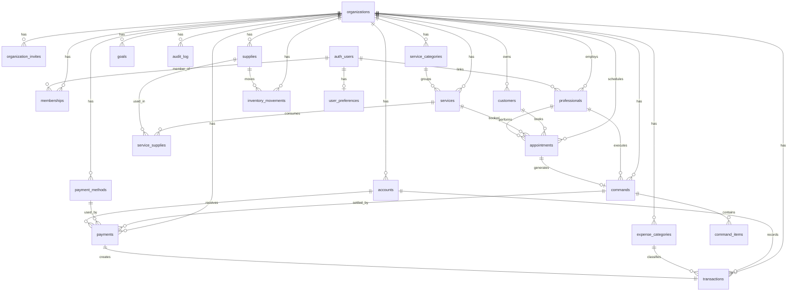

# KEYRA — Database Schema (Story 0.4)

> **Status:** v1.0 — Initial schema for Phases 1–4 (MVP) with stable stubs for Phase 5+
> **Author:** @data-engineer (Dara)
> **Date:** 2026-04-16
> **Source of truth:** `supabase/migrations/20260416*.sql` (18 files)
> **Constitution:** Article IV (No Invention) — every table & column traces to a PRD FR/CON or ADR

---

## 0. TL;DR

- 19 application tables + 5 reporting views. All tenant-scoped tables have `org_id`, RLS enabled + forced, soft delete, `created_at`/`updated_at` with trigger.
- RLS isolation is enforced via a single policy per table: `org_id = current_org_id()`. `current_org_id()` reads the JWT custom claim injected by `custom_access_token_hook` (ADR-012).
- Three critical triggers make "operation drives finance" automatic:
  1. `appointments.status → done` creates a `commands` + `command_items` (snapshots service price/cost/commission).
  2. `payments INSERT` creates a 1:1 `transactions` row, updates `commands.paid_amount/status`, and — when fully paid — runs the insumo rateio via `inventory_movements`.
  3. Any mutation on a tenant-scoped table emits a row to `audit_log` (append-only).
- Monetary values are `numeric(14,2)` everywhere (P4 / NFR-FI-02). `round_half_even()` provides banker's rounding server-side when needed.
- `v_receitas_previstas`, `v_dre_monthly`, `v_dre_by_service`, `v_dre_by_professional`, `v_cashflow_daily`, `v_dashboard_kpis` are regular views (will be promoted to materialized in Phase 5 if the NFR-PE-03 3-second budget is at risk).

---

## 1. Migration files (order matters)

| # | File | Purpose |
|---|------|---------|
| 001 | `20260416000100_extensions.sql` | pgcrypto, uuid-ossp, pg_trgm, citext, btree_gist |
| 002 | `20260416000200_helper_functions.sql` | `current_org_id()`, `is_org_member()`, `set_updated_at()`, `enforce_org_id_immutability()`, `round_half_even()` |
| 003 | `20260416000300_organizations.sql` | `organizations`, `memberships`, `organization_invites` |
| 004 | `20260416000400_auth_setup.sql` | `user_preferences`, Supabase `custom_access_token_hook` (JWT org_id) |
| 005 | `20260416000500_professionals.sql` | `professionals` |
| 006 | `20260416000600_customers.sql` | `customers` (CRM, CPF encrypted) |
| 007 | `20260416000700_services.sql` | `service_categories`, `services` |
| 008 | `20260416000800_inventory.sql` | `supplies`, `service_supplies`, `inventory_movements` (append-only) |
| 009 | `20260416000900_appointments.sql` | `appointments` + `v_receitas_previstas` |
| 010 | `20260416001000_commands.sql` | `commands`, `command_items` + subtotal recompute trigger |
| 011 | `20260416001100_financial_accounts.sql` | `accounts`, `expense_categories`, `payment_methods`, `goals` |
| 012 | `20260416001200_transactions.sql` | `transactions` (financial ledger) |
| 013 | `20260416001300_payments.sql` | `payments` (command settlements) |
| 014 | `20260416001400_triggers_automation.sql` | appointment→command, payment→transaction, inventory rateio |
| 015 | `20260416001500_dre_views.sql` | DRE monthly, per-service, per-professional, cashflow, KPIs |
| 016 | `20260416001600_audit_log.sql` | Universal audit trigger + `audit_log` append-only |
| 017 | `20260416001700_rls_policies.sql` | RLS enable/force + policies + role grants |
| 018 | `20260416001800_seed_plano_contas.sql` | `seed_default_chart_of_accounts(org_id)` bootstrap helper |

All filenames use the `YYYYMMDDHHMMSS_description.sql` convention — Supabase CLI sorts lexicographically.

---

## 2. Entity-relationship diagram



---

## 3. Table reference

Legend: **PK** = primary key, **FK** = foreign key, **RLS** row-level security active.
Naming: `snake_case`, plural tables, `<entity>_id` for FKs.

### 3.1 Tenant root & membership

#### `organizations`
- **Purpose:** tenant root (clinic/studio).
- **PK:** `id uuid`.
- **Key columns:** `name`, `slug (citext unique)`, `plan`, `subscription_status`, `trial_ends_at`, `timezone`, `currency`, `deleted_at`.
- **RLS:** member can SELECT, admin/owner can UPDATE, owner can DELETE. INSERT open (new user creates their org in onboarding; app code auto-inserts owner membership).
- **Maps to:** FR-MT-01, ADR-011.

#### `memberships`
- **Purpose:** `(user_id, org_id, role)` join. Role hierarchy: `owner > admin > professional > viewer`.
- **PK:** `id`. Unique `(user_id, org_id)`.
- **RLS:** user sees own rows + admins see all rows of their org.
- **Maps to:** ADR-012, FR-MT-02.

#### `organization_invites`
- **Purpose:** outstanding invites by email with expiring token.
- **RLS:** admin/owner of org only.

#### `user_preferences`
- **Purpose:** per-user `active_org_id` (used by the JWT hook to choose default org) + onboarding flags.
- **RLS:** user sees only their own row.

### 3.2 Catalog & inventory

#### `professionals`
- Performs services; may or may not be an `auth.users`. `default_commission_rate` is snapshotted into command_items at execution time.
- FR-AG-05, FR-MT-02, FR-FI-04, FR-DR-03.

#### `customers` (CRM)
- `cpf_encrypted bytea` (pgp_sym_encrypt, ADR-017) + `cpf_hash text` for dedupe.
- `notes` is free-form, **NOT** clinical prontuário (CON-ES-07).
- `consent_lgpd_at` records LGPD acceptance timestamp (CON-LG-04).
- FR-PA-01, FR-PA-02.

#### `service_categories`, `services`
- `services.type` ∈ `service | product | protocol | package | combo` (FR-SV-01).
- `services.price`, `services.unit_cost` as `numeric(14,2)`; `commission_rate` optional override per service.
- `package_sessions` stubs Phase 5 pacotes (FR-SV-05/06) without schema change later.
- FR-SV-01..04.

#### `supplies`
- `current_stock numeric(14,3)` is a **cache**; the source of truth is `inventory_movements`. The trigger `supplies_apply_movement()` keeps it consistent on INSERT.
- `reorder_level` + partial index drives FR-ES-03 alerts (fires when `current_stock <= reorder_level`).

#### `service_supplies`
- M:N with `quantity` consumed per service unit. Unique on `(service_id, supply_id)`.
- FR-SV-03.

#### `inventory_movements`
- **Append-only ledger.** `UPDATE` and `DELETE` blocked by trigger.
- `movement_type` ∈ `entry | exit | adjustment | service_consumption | loss`.
- `quantity` is signed (entry/adjustment > 0, exit/consumption < 0).
- FR-ES-01, FR-ES-02.

### 3.3 Operation (the heart)

#### `appointments` (agenda — CON-KE-01)
- First-class FullCalendar columns: `title`, `starts_at`, `ends_at`, `all_day`, `color`, `professional_id` (resource), `status`.
- `status` ∈ `scheduled | done | cancelled | no_show`. Only `done` triggers command creation.
- `price_snapshot` captures `service.price` at scheduling (FR-AG-04 receita prevista).
- **EXCLUDE USING gist** (btree_gist) prevents double-booking: same professional cannot have overlapping `(starts_at, ends_at)` ranges in active statuses.
- `v_receitas_previstas` aggregates `scheduled` rows by day/month.
- FR-AG-01..07.

#### `commands` (comanda — ordem de serviço)
- Unique `appointment_id` (1:0..1). Walk-in flow kept open for future: column is nullable.
- `total numeric(14,2) GENERATED ALWAYS AS (subtotal - discount_amount) STORED` — always consistent.
- `paid_amount` updated by `trg_payment_creates_transaction`; status transitions automatically: `open → finalized → paid`.
- FR-CO-01..05.

#### `command_items`
- Snapshots of `unit_price`, `unit_cost`, `commission_rate` (ADR-013 #7 — preserve history even if services change later).
- `total numeric(14,2) GENERATED ALWAYS AS ((unit_price * quantity) - discount_amount) STORED`.
- Trigger `recompute_command_subtotal()` keeps `commands.subtotal = sum(command_items.total)`.

### 3.4 Finance

#### `accounts`
- Caixa, checking, acquirer, wallet. `opening_balance` + sum of transactions = current balance (computed by app).
- FR-FI-06.

#### `expense_categories` — plano de contas
- Hierarchical via `parent_id`. `kind` ∈ `revenue | variable_cost | fixed_cost | operating_expense | tax | other`.
- `seed_default_chart_of_accounts(org_id)` (migration 018) bootstraps ~30 default entries for estética + MEI/Simples.
- FR-FI-05.

#### `payment_methods`
- `fee_rate` + `fee_fixed` + `settlement_days` (D+N). Snapshotted into `payments` at the moment of settlement so changing the rate later does NOT rewrite history.
- FR-CO-04/05.

#### `payments`
- 1 command : N payments (partial/multi-method FR-CO-04 supported).
- 1 payment : 1 transaction (unique `transaction_id`, set by the `trg_payment_creates_transaction` BEFORE INSERT trigger).
- `amount_coherent` CHECK guarantees `net_amount = gross_amount - fee_amount`.

#### `transactions`
- The ledger. `direction` ∈ `credit | debit`. `origin` ∈ `command_payment | manual_income | manual_expense | bank_import | adjustment`.
- `amount_coherent` CHECK: credits must satisfy `net = gross - fee`; debits must have `fee = 0` and `net = gross`. Keeps DRE math clean.
- `is_fixed boolean` supports FR-CP-01 / FR-FI-03 (custos fixos vs variáveis).
- FR-FI-01, FR-FI-02, FR-FI-06.

#### `goals`
- Monthly target: revenue, profit, appointments. Unique `(org_id, period_month)`.
- FR-IN-06, FR-DA-07.

### 3.5 Observability

#### `audit_log`
- Append-only (UPDATE/DELETE blocked). Universal AFTER trigger attached to every tenant-scoped table (migration 016).
- Columns: `org_id`, `user_id`, `action`, `resource_type`, `resource_id`, `before jsonb`, `after jsonb`, `ip_address`, `user_agent`, `created_at`.
- ADR-018, CON-LG-06, NFR-SE-05.

---

## 4. Views (reporting)

| View | Source | Purpose |
|------|--------|---------|
| `v_receitas_previstas` | `appointments (status=scheduled)` | FR-AG-04: daily/monthly expected revenue |
| `v_dre_monthly` | `transactions` + `command_items` (paid) | FR-DR-01: full DRE |
| `v_dre_by_service` | `command_items` (paid) | FR-DR-02: lucro por serviço (DIFERENCIAL) |
| `v_dre_by_professional` | `command_items` (paid) | FR-DR-03: lucro por profissional |
| `v_cashflow_daily` | `transactions` | FR-FI-06: fluxo de caixa diário |
| `v_dashboard_kpis` | multiple | FR-DA-03/04/05: KPIs tela única (revenue MTD, expected, expenses, appointments today) |

All views sit inside `public` — RLS on the underlying tables already filters rows per tenant (views do not bypass RLS because they use the invoker's rights).

---

## 5. RLS model

### Helpers
```sql
current_org_id()                           -- returns JWT claim org_id (NULL if absent → deny)
is_org_member(target_org, min_role)        -- role-aware membership test
```

### Policy shape (for 15 tenant-scoped tables)
```sql
CREATE POLICY <table>_tenant_isolation ON public.<table>
  FOR ALL TO authenticated
  USING (org_id = public.current_org_id())
  WITH CHECK (org_id = public.current_org_id());
```

### Coverage
- **19 / 19** tenant-scoped & user-scoped tables have RLS enabled + forced (100%).
- **`audit_log`**: read-only for authenticated users of the same org; writes only via SECURITY DEFINER trigger.
- **Special:** `organizations` uses `is_org_member(id, …)` because it has no `org_id` (it IS the org).

### JWT hook
`custom_access_token_hook(event jsonb)` (migration 004) injects `org_id` into the JWT on every token issue. Needs to be enabled in Supabase Dashboard → Authentication → Hooks, or via `config.toml`:

```toml
[auth.hook.custom_access_token]
enabled = true
uri = "pg-functions://postgres/public/custom_access_token_hook"
```

Tests (`supabase/tests/rls_isolation.test.sql`) validate 2-org / 2-user isolation across SELECT, INSERT, UPDATE, DELETE and the no-claim deny case.

---

## 6. Decision log (KEYRA-specific, autonomous)

Any non-trivial decision made without explicit approval is listed here with rationale. These are flagged for Luiz to accept/overrule.

### 6.1 `numeric(14,2)` over `bigint cents`
Per ADR-005 the app uses Decimal.js at the boundary. Postgres `numeric(14,2)` preserves exact decimal semantics, tax calculations (`gross * 0.0349`) stay readable, and SQL reports render correctly without application-side cents/100 conversion. Max value `999 999 999 999.99` is enough for estética (Gestek target is ~R$ 60K/mo). NFR-FI-02 says "integer em centavos" but also "avoid imprecisão de float" — both goals are met by `numeric(p,s)` which is **exact** and independent of float. Documented as `[AUTO-DECISION] bigint-cents → numeric(14,2) (reason: tax% math + report readability + already exact; app-side Decimal.js still enforces rounding).`

### 6.2 EXCLUDE constraint on appointments
Double-booking same professional is a common real-world bug in agenda systems. We use `EXCLUDE USING gist (professional_id WITH =, tstzrange(starts_at, ends_at) WITH &&)` with a partial `WHERE status IN ('scheduled','done') AND deleted_at IS NULL`. This is defense-in-depth vs FR-AG-05 — app code should also check, but DB is the last line. Extension `btree_gist` is cheap (<100KB).

### 6.3 Views (not materialized views) for MVP DRE
NFR-PE-03 targets `<3s` for 12-month DRE at **200 atendimentos/mês** (NFR-PE-04). With the index set defined, `v_dre_monthly` aggregates trivially (≤2400 transactions + ≤2400 command_items per year per org). Materialization adds refresh complexity (and stale data) for no measurable win at MVP scale. Promotion to materialized is a Phase 5 story gated by a real performance test.

### 6.4 `organizations.subscription_status` as `text CHECK`, not enum
Postgres enums are painful to evolve. `text + CHECK (in (...))` lets a migration add a new state trivially. Stripe's set (`active | past_due | canceled | trialing | incomplete | paused`) is already captured.

### 6.5 `audit_log` as single table (not per-entity)
A single append-only table with `resource_type`/`resource_id` + jsonb `before/after` is the standard pattern. Partitioning by month (pg_partman) is a Phase 5 concern when log volume becomes a cost driver (ADR-018 retention 5yr).

### 6.6 Snapshot commission_rate into command_items
Preserves history across future professional rate changes (ADR-013 #7). The trigger `trg_appointment_done_creates_command` captures `service.commission_rate > professional.default_commission_rate > 0` precedence at execution time.

### 6.7 `payment_methods` rates snapshotted into `payments`
Same reasoning — `fee_rate_snapshot` + `fee_fixed_snapshot` + `fee_amount` all stored on `payments`. The DRE must reflect the rate that was charged, not today's rate.

### 6.8 Package/Combo columns present but Phase-5-flagged
`services.package_sessions` is NULLable and untouched by MVP UI. Keeping it in 0.4 avoids an `ALTER TABLE services` in Phase 5.

### 6.9 `customers.cpf_hash` alongside `cpf_encrypted`
ADR-017 acknowledges "queries por CPF ficam impossíveis sem desencriptar. Aceito (busca por CPF é raro; usar hash em coluna separada se necessário)." We added the hash now so the schema is stable.

### 6.10 Seed chart-of-accounts as a function, not a plain seed.sql
The seed.sql in Supabase is local-dev only and not per-tenant. `seed_default_chart_of_accounts(org_id)` runs at onboarding from the Server Action and is idempotent.

### 6.11 `FORCE ROW LEVEL SECURITY` on every table
Without FORCE, the table owner (the `postgres` role) bypasses RLS — which means any superuser query or admin tool leaks cross-tenant. FORCE makes RLS apply to *all* roles except `BYPASSRLS`-granted ones. Supabase's `service_role` has BYPASSRLS so server jobs still work.

---

## 7. Mapping: PRD FR → schema

| FR | Table / mechanism |
|----|-------------------|
| FR-AG-01..03 | `appointments.starts_at/ends_at/status`, `v_dashboard_kpis` |
| FR-AG-04 | `appointments.price_snapshot` + `v_receitas_previstas` |
| FR-AG-05 | `appointments.professional_id` + `EXCLUDE` constraint |
| FR-AG-06 | trigger `trg_appointment_done_creates_command` |
| FR-PA-01..02 | `customers` |
| FR-PA-03/04 | `v_dre_by_professional` joins with future `v_customer_ltv` (Phase 6) |
| FR-SV-01..04 | `services`, `service_categories` |
| FR-SV-03 | `service_supplies` |
| FR-CO-01..04 | `commands`, `command_items`, trigger |
| FR-CO-05 | `payment_methods.fee_rate/fee_fixed` snapshot into `payments` |
| FR-FI-01 | trigger `trg_payment_creates_transaction` |
| FR-FI-02 | `transactions (origin=manual_expense)` |
| FR-FI-03 | `transactions.is_fixed` + `expense_categories.kind` |
| FR-FI-04 | `transactions.professional_id` |
| FR-FI-05 | `expense_categories` + `seed_default_chart_of_accounts()` |
| FR-FI-06 | `v_cashflow_daily` |
| FR-CP-01/02 | `expense_categories.kind=fixed_cost/variable_cost` |
| FR-DR-01..03 | `v_dre_monthly`, `v_dre_by_service`, `v_dre_by_professional` |
| FR-ES-01..02 | `supplies`, `inventory_movements`, consumption trigger |
| FR-ES-03 | `supplies.reorder_level` + partial index |
| FR-DA-01..06 | `v_dashboard_kpis`, `v_receitas_previstas` |
| FR-IN-06 | `goals` |
| FR-MT-01..04 | `organizations`, `memberships`, `organization_invites`, RLS policies |

---

## 8. Open items (need Luiz input)

1. **JWT Auth Hook enablement** — `custom_access_token_hook` is created; the Supabase dashboard switch must be flipped (Authentication → Hooks) for it to start emitting `org_id`. Until then, all RLS returns zero rows (fails closed, which is safe).
2. **CPF encryption key rotation story** — `COLUMN_ENCRYPTION_KEY` is referenced by ADR-017 as a Vercel env var; we need a rotation runbook (Phase 5 story).
3. **Retention / pg_partman for audit_log** — at 5-year retention and >1K orgs the table gets big. Schedule Phase 5 partition migration.
4. **Stripe subscription mirror table** — ADR-016 says source of truth is Stripe and DB is a cache. We stored `plan` + `subscription_status` on `organizations` directly; a dedicated `subscriptions` table (one-to-many for upgrade history) can land in the paywall story (ADR-016 footnote).
5. **NFS-e module tables** — D11 moved NFS-e to Phase 8. No tables here.

---

## 9. Operational notes

- **Dry-run before apply:** `supabase db diff --linked --schema public` from the repo root shows pending DDL against `keyra-br`.
- **Local dev:** `supabase db reset` applies every migration + runs the seed (if any). After reset, run `psql -f supabase/tests/rls_isolation.test.sql` to validate RLS.
- **Remote apply:** `supabase db push` will run them in order against `keyra-br` — currently on hold pending Luiz approval.
- **Rollback:** there are no DROP statements in these migrations (everything is CREATE IF NOT EXISTS / CREATE OR REPLACE). A rollback script would use `DROP TABLE ... CASCADE` in reverse dependency order. Since the DB is still empty, the cheapest rollback right now is `supabase db reset` (wipes local) and not pushing remote.

---

*KEYRA Schema v1.0 — "O financeiro é gerado pelo banco de dados, não pelo usuário."*
