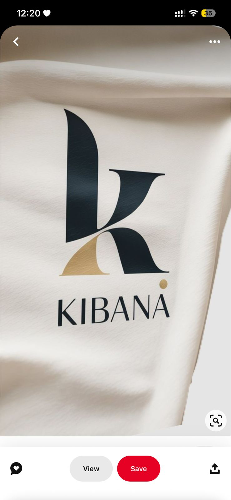

# Kibana — Logo + Marca

## O que é

Logo de marca chamada Kibana, fotografada sobre tecido cor creme/marfim com leve textura. Logotipo composto por:
- **Marca gráfica:** letra "K" estilizada em forma de **wave/onda fluida** preta, com curva descendente e contracurva subindo, criando uma silhueta que parece dois cumes encostados
- **Detalhe dourado:** acento foil-gold em formato de meia-lua/folha embutido na base do K
- **Wordmark:** "KIBANA" em serif elegante condensada, weight regular, com pontinho dourado sobre o segundo "A" (substituindo o til/acento)

**Fonte do print:** Pinterest (saved by user). Marca real ou fictícia — irrelevante; serve como referência de **forma + acabamento**.

---

## Por que está aqui

A idealizadora salvou. É **a referência mais próxima da identidade pretendida** para KEYRA: feminina sem ser doce, sofisticada, geometria fluida com tom orgânico.

## O que aproveitar para KEYRA

| Elemento | Aplicação direta na KEYRA |
|----------|---------------------------|
| **Forma do K em onda fluida** | A KEYRA também começa com "K". A silhueta orgânica/fluida (em vez de geométrica rígida) é o caminho do logo KEYRA — passa cuidado, gentileza, movimento natural |
| **Acabamento foil dourado** | Confirma que **ouro é o acento** da marca (não cor base). Em digital traduz para `#B8923A` a `#D4A752` |
| **Tecido marfim como suporte** | Background base não é branco gelo — é creme quente (`ivory-50` `#FAF6EE`). Sensação tátil têxtil |
| **Pontinho/detalhe dourado no wordmark** | Possibilidade de o "i" da KEYRA carregar o detalhe dourado (substituindo ponto). Ou um glifo dourado discreto no espaço do "A" |
| **Wordmark em serif condensada elegante** | Confirma o caminho tipográfico: serif display alto-contraste, não sans tech |

## O que **não** copiar

- A forma específica de "duas ondas" do K — KEYRA precisa do próprio gesto, não do mesmo
- A composição vertical exata (símbolo gigante + wordmark embaixo) — é o padrão genérico de identidade beauty; podemos quebrar
- Qualquer rastro de "Kibana" nominalmente — é outra marca

## Decisões que isso alimenta

1. **Logo KEYRA** será letterform-based partindo do "K", com gesto orgânico (não geométrico-modular)
2. **Detalhe dourado** entra como **assinatura** discreta — uma vez na marca, não em todo lugar
3. **Background base** dos materiais brand é cor têxtil quente, não branco puro

---

_Adicionado em 2026-05-07 a partir de 12 referências entregues pela idealizadora._
