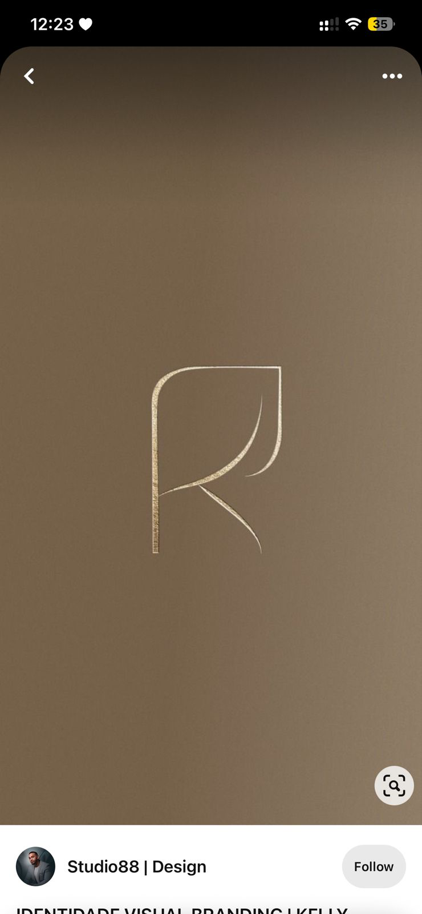

# Studio88 — Monograma R

## O que é

Monograma da letra "R" em **ouro foil/metálico** sobre fundo bronze profundo (cor de oliva queimada / cocoa quente). Linhas monoline, peso muito fino, contornos elegantes minimalistas. A silhueta do R é estilizada — a perna direita curva-se em uma linha solta que sai do contorno principal, dando movimento.

**Crédito:** Studio88 | Design (visto via Pinterest).

## Por que está aqui

Define o **acabamento de luxo discreto** que a KEYRA persegue:
- Linha fina, não bold
- Ouro foil tátil sobre superfície quente escura
- Movimento dentro do letterform (linha "extra" que escapa)
- Quase nenhum contraste — peça respirando no fundo, não gritando

## O que aproveitar para KEYRA

| Elemento | Aplicação direta na KEYRA |
|----------|---------------------------|
| **Linhas monoline finas** | Possibilidade de uma versão **mono-line / outline** do logo KEYRA, complementar ao logo principal — útil para fundo escuro premium |
| **Ouro sobre cocoa profundo** | Combinação de cor canônica para **modo dark/brand-premium** da KEYRA: fundo `coffee-900` `#2B1810` + linha `gold-500` `#B8923A` |
| **Linha "extra" com movimento** | A identidade KEYRA pode ter um **gesto orgânico** que escapa do letterform — não é só letra contornada, é letra com vida |
| **Composição centrada com muito ar** | Confirma o uso de **spacing roomy** — peça respirando, não comprimida |

## O que **não** copiar

- A textura de foil renderizada literalmente em digital — em UI fica brega, vira efeito 90s. Em digital, ouro é **cor sólida** (`#B8923A`). Foil só em peças impressas/PDF de propostas premium
- Monograma de uma letra solta sem wordmark — a KEYRA precisa do nome legível em UI funcional

## Decisões que isso alimenta

1. **Logo KEYRA tem 2 versões:**
   - **Primária:** logotipo completo "KEYRA" em wordmark + glifo (letra K estilizada)
   - **Secundária:** monograma "K" para favicon, app icon, marca d'água
2. **Versão monoline outline** existe para usos especiais (fundo escuro, peças premium impressas)
3. **Modo dark da brand** usa `coffee-900` + `gold-500` — não é "dark mode" do app, é **modo premium de marca**

---

_Adicionado em 2026-05-07._
