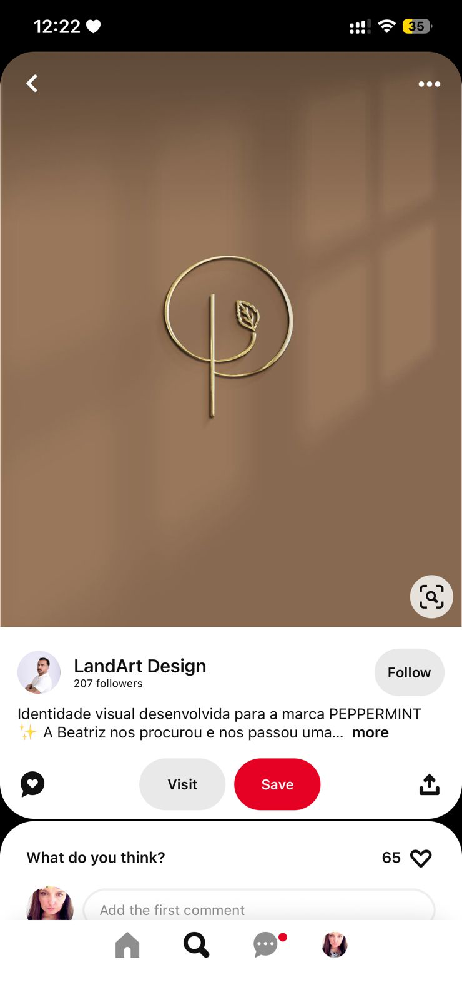

# Peppermint — Logo P + Folha

## O que é

Logo da marca PEPPERMINT (LandArt Design). Composição:
- Letra **P** monoline em ouro/latão escovado
- Inscrita em **círculo** que circula a haste
- Pequena **folha estilizada** (leaf icon) integrada à curva do P, no canto superior direito
- Fundo bronze quente cor de couro/oliva queimada
- Aplicação física: parece logo em parede com luz natural caindo (sombra suave)

**Crédito:** LandArt Design (Pinterest).

## Por que está aqui

Confirma a **família estética** que a idealizadora está perseguindo: monoline gold + neutros quentes profundos + pequeno elemento orgânico (folha) integrado ao letterform.

## O que aproveitar para KEYRA

| Elemento | Aplicação direta na KEYRA |
|----------|---------------------------|
| **Elemento orgânico discreto integrado ao letterform** | A KEYRA pode ter um **microelemento** integrado ao "K" ou ao "Y" — não literal (folha bate caro estética), mas algo equivalente: um **traço orgânico**, um **brilho/spark**, um detalhe que humaniza a tipografia |
| **Inscrição em forma geométrica simples** | Possibilidade de versão "selo" da KEYRA dentro de um círculo — para badges, avatars de social media, sticker |
| **Iluminação tátil em mockup** | Quando apresentar a marca em decks/proposals, mockup com luz natural sutil (não photoshop neon) — sensação de objeto real |

## O que **não** copiar

- Folha literal — clichê de spa/wellness. Para SaaS financeiro de estética, folha é o sinal errado (estamos falando de **negócio**, não de skincare)
- Composição "logo solitário gigante centrado em parede" — é estética de salão de beleza, não de software de gestão. KEYRA é mais editorial, menos salão

## Decisões que isso alimenta

1. **NÃO usar elementos botânicos** (folha, planta, gota) no logo — isso é o que clínicas de estética **clientes** da KEYRA podem usar; KEYRA precisa se diferenciar como **categoria de software**, não como mais um spa
2. **Microelemento orgânico integrado** entra como possibilidade — mas precisa ser **abstrato**: um traço, um spark, um diacrítico estilizado, não símbolo concreto
3. **Versão "selo"** (logo dentro de círculo/forma fechada) é variante secundária para usos sociais

---

## Anti-padrão associado a essa referência

Esta referência ilumina **o que não fazer**: virar mais uma marca de spa/skincare. KEYRA é **B2B SaaS para donas de clínica** — a cliente não compra produto cosmético, compra **controle do negócio**. A marca precisa carregar elegância da estética **e** seriedade de software.

A folha do Peppermint é graciosa, mas é o caminho fácil. KEYRA tem que ir um passo além: editorial luxury **com gravitas**.

---

_Adicionado em 2026-05-07._
